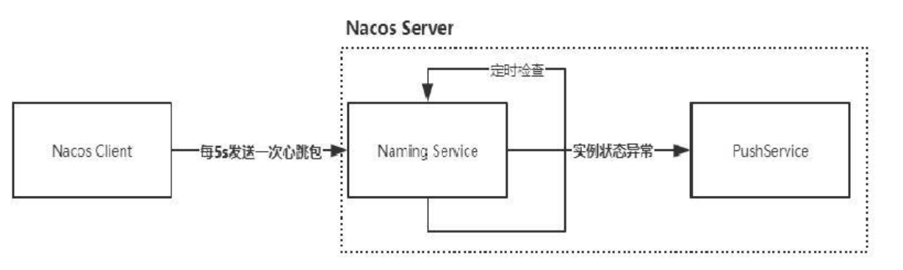
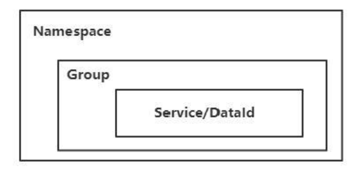
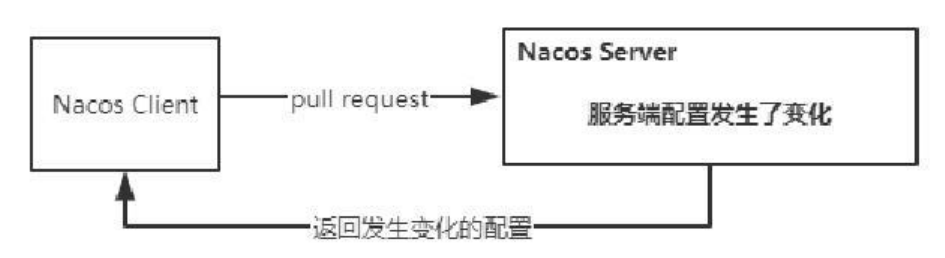
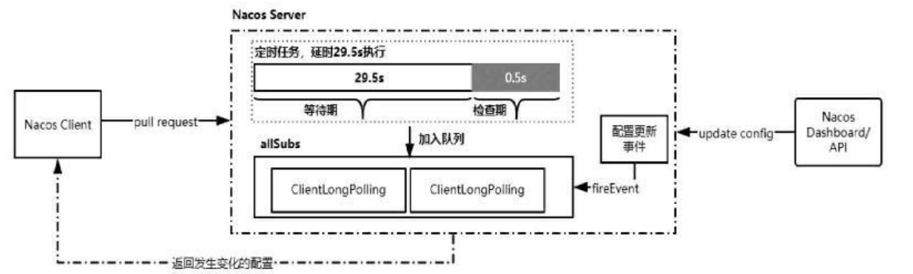

# Nacos

​		`Nacos`致力于解决微服务中的统一配置、服务注册与发现等问题。它提供了一组简单易用的特性集，帮助开发者快速实现动态服务发现、服务配置、服务元

数据及流量管理。

​		特性：

​				**服务发现和服务健康监测**：`Nacos`支持基于`DNS`和基`于RPC`的服务发现。服务提供者使用原生`SDK`、`OpenAPI`或一个独立的`Agent TODO`注册`Service`

​		后，服务消费者可以使用`DNS`或`HTTP&API`查找和发现服务。`Nacos`提供对服务的实时的健康检查，阻止向不健康的主机或服务实例发送请求。`Nacos`支持传

​		输层`(PING`或`TCP)`和应用层的健康检查。对于复杂的云环境和网络拓扑环境中服务的健康检查，`Nacos`提供了`agent`上报和服务端主动检测两种健康检查模

​		式。`Nacos`还提供了统一的健康检查仪表盘，帮助用户根据健康状态管理服务的可用性及流量。

​				**动态配置服务**：业务服务一般都会维护一个本地配置文件，然后把一些常量配置到这个文件中。这种方式在某些场景中会存在问题，比如配置需要变更

​		时要重新部署应用。而动态配置服务可以以中心化、外部化和动态化的方式管理所有环境的应用配置和服务配置，可以使配置管理变得更加高效和敏捷。配置

​		中心化管理让实现无状态服务变得更简单，让服务按需弹性扩展变得更容易。另外，`Nacos`提供了一个简洁易用的`UI`帮助用户管理所有服务和应用的配置。

​		`Nacos`还提供了包括配置版本跟踪、金丝雀发布、一键回滚配置及客户端配置更新状态跟踪在内的一系列开箱即用的配置管理特性，帮助用户更安全地在生

​		产环境中管理配置变更，降低配置变更带来的风险。

​				**动态`DNS`服务**：动态`DNS`服务支持权重路由，让开发者更容易地实现中间层负载均衡、更灵活的路由策略、流量控制，以及数据中心内网的简单`DNS`解

​		析服务。

​				**服务及其元数据管理**：`Nacos`可以使开发者从微服务平台建设的视角管理数据中心的所有服务及元数据，包括管理服务的描述、生命周期、服务的静态

​		依赖分析、服务的健康状态、服务的流量管理、路由及安全策略、服务的`SLA`及最重要的`metrics`统计数据。


​		`Provider APP`：服务提供者。

​		`Consumer APP`：服务消费者。

​		`Name Server`：通过`VIP(Vritual IP)`或者`DNS`的方式实现`Nacos`高可用集群的服务路由。

​		`Nacos Server`：`Nacos`服务提供者，里面包含的`Open API`是功能访问入口，`Config Service、Naming Service`是`Nacos`提供的配置服务、名字服务模块。

`Consistency Protocol`是一致性协议，用来实现`Nacos`集群节点的数据同步，这里使用的是`Raft`算法。

​		`Nacos Console`：`Nacos`控制台。

​		整体来说，服务提供者通过`VIP(Virtual IP)`访问`Nacos Server`高可用集群，基于`Open API`完成服务的注册和服务的查询。`Nacos Server`本身可以支持主

备模式，所以底层会采用数据一致性算法来完成从节点的数据同步。服务消费者也是如此，基于`Open API`从`Nacos Server`中查询服务列表。

```shell
startup.cmd -m standalone
```


## 注册中心

​		服务注册的功能主要体现在：

​				服务实例在启动时注册到服务注册表,并在关闭时注销。

​				服务消费者查询服务注册表，获得可用实例。

​				服务注册中心需要调用服务实例的健康检查`API`来验证它是否能够处理请求。


​		`ServiceRegistry`，它是`Spring Cloud`提供的服务注册的标准。集成到`Spring Cloud`中实现服务注册的组件，都会实现该接口：

```java
public interface ServiceRegistry<R extends Registration> {

	void register(R registration);

	void deregister(R registration);

	void close();

	void setStatus(R registration, String status);

	<T> T getStatus(R registration);
}
```

​		`NacosServiceRegistry`实现了`ServiceRegistry`接口将`Nacos`作为服务注册组件。`Spring Cloud`基于`Spring Boot`，而在`Spring Boot`启动时会获取类路径

下`META-INF/spring.factoriest`中`org.springframework.boot.autoconfigure.EnableAutoConfiguration`键对应的值，然后通过类上的条件将符合条件的类实例加

入到`IOC`容器中。`spring-cloud-commons`包的`META-INF/spring.factoriest`：

```properties
# AutoConfiguration
org.springframework.boot.autoconfigure.EnableAutoConfiguration=\
org.springframework.cloud.client.CommonsClientAutoConfiguration,\
org.springframework.cloud.client.ReactiveCommonsClientAutoConfiguration,\
...\
org.springframework.cloud.client.serviceregistry.AutoServiceRegistrationAutoConfiguration

```

```java
@Configuration(proxyBeanMethods = false)
@Import(AutoServiceRegistrationConfiguration.class)
@ConditionalOnProperty(value = "spring.cloud.service-registry.auto-registration.enabled",
		matchIfMissing = true)
public class AutoServiceRegistrationAutoConfiguration {

	@Autowired(required = false)
    // 注入实例
	private AutoServiceRegistration autoServiceRegistration;

	@Autowired
	private AutoServiceRegistrationProperties properties;

	@PostConstruct
	protected void init() {
		if (this.autoServiceRegistration == null && this.properties.isFailFast()) {
			throw new IllegalStateException("Auto Service Registration has "
					+ "been requested, but there is no AutoServiceRegistration bean");
		}
	}
}
```


​		`ApplicationListener`是`Spring`中的事件监听机制，用于监听某个指定的事件。而`AbstractAutoServiceRegistration`实现了该抽象方法，并且监听`WebServerInitializedEvent`事件`(`当`Webserver`初始化完成之后`)`：

```java
// AbstractAutoServiceRegistration 类
public void onApplicationEvent(WebServerInitializedEvent event) {
	bind(event); // 最终会调用 NacosServiceRegistry#register 方法进行服务注册
}
```


​		`Spring Cloud Alibaba Dubbo`集成`Nacos`时，服务的注册是依托`Dubbo`中的自动装配机制完成的。`spring-cloud-alibaba-dubbo`下的`META-`

`INF/spring.factories`文件中自动装配了一个和服务注册相关的配置类`DubboServiceRegistrationNonWebApplicationAutoConfiguration`：

```properties
org.springframework.boot.autoconfigure.EnableAutoConfiguration=\
com.alibaba.cloud.dubbo.autoconfigure.DubboServiceRegistrationNonWebApplicationAutoConfiguration,\
...
```

```java
@Configuration(proxyBeanMethods = false)
@ConditionalOnNotWebApplication
@ConditionalOnProperty(value = "spring.cloud.service-registry.auto-registration.enabled",
		matchIfMissing = true)
@AutoConfigureAfter(DubboServiceRegistrationAutoConfiguration.class)
@Aspect
public class DubboServiceRegistrationNonWebApplicationAutoConfiguration {

	private static final String REST_PROTOCOL = "rest";

	@Autowired
	private ServiceRegistry serviceRegistry; // 实现类为 NacosServiceRegistry

	@Autowired
	private Registration registration;

	private volatile Integer serverPort = null;

	private volatile boolean registered = false;

	@Autowired
	private DubboServiceMetadataRepository repository;

	@Around("execution(* org.springframework.cloud.client.serviceregistry.Registration.getPort())")
	public Object getPort(ProceedingJoinPoint pjp) throws Throwable {

		setServerPort();
		return serverPort != null ? serverPort : pjp.proceed();
	}

    // ApplicationStartedEvent 事件，该事件是在刷新上下文之后、调用 application 命令之前触发的。

	@EventListener(ApplicationStartedEvent.class)
	public void onApplicationStarted() {
		register();
	}

	private void register() {
		if (registered) {
			return;
		}
		serviceRegistry.register(registration); // 调用 NacosServiceRegistry#register 实现服务注册
		registered = true;
	}

	...
}
```

```java
// NacosServiceRegistry 类
public void register(Registration registration) {

		if (StringUtils.isEmpty(registration.getServiceId())) {
			log.warn("No service to register for nacos client...");
			return;
		}

		NamingService namingService = namingService();
		String serviceId = registration.getServiceId();
		String group = nacosDiscoveryProperties.getGroup();

		Instance instance = getNacosInstanceFromRegistration(registration);

		try {
			namingService.registerInstance(serviceId, group, instance);
			log.info("nacos registry, {} {} {}:{} register finished", group, serviceId,
					instance.getIp(), instance.getPort());
		}
		catch (Exception e) {
			if (nacosDiscoveryProperties.isFailFast()) {
				log.error("nacos registry, {} register failed...{},", serviceId,
						registration.toString(), e);
				rethrowRuntimeException(e);
			}
			else {
				log.warn("Failfast is false. {} register failed...{},", serviceId,
						registration.toString(), e);
			}
		}
}
```

​		`namingService.registerInstance()`方法的实现，主要逻辑：

​				通过`beatReactor.addBeatInfo`创建心跳信息实现健康检测，`Nacos Server`必须要确保注册的服务实例是健康的，而心跳检测就是服务健康检测的手

​		段。

​				实现服务注册。

```java
// BeatReactor 类
public void addBeatInfo(String serviceName, BeatInfo beatInfo) {
        NAMING_LOGGER.info("[BEAT] adding beat: {} to beat map.", beatInfo);
        String key = buildKey(serviceName, beatInfo.getIp(), beatInfo.getPort());
        BeatInfo existBeat;
        //fix #1733
        if ((existBeat = dom2Beat.remove(key)) != null) {
            existBeat.setStopped(true);
        }
        dom2Beat.put(key, beatInfo);
    	// 定时发送心跳包，executorService 是 ScheduledThreadPoolExecutor 线程池的实例
        executorService.schedule(new BeatTask(beatInfo), beatInfo.getPeriod(), TimeUnit.MILLISECONDS);
        MetricsMonitor.getDom2BeatSizeMonitor().set(dom2Beat.size());
}
```

​		从上述代码看，所谓心跳机制就是客户端通过`schedule`定时向服务端发送一个数据包，然后启动一个线程不断检测服务端的回应，如果在设定时间内没有收

到服务端的回应，则认为服务器出现了故障。`Nacos`服务端会根据客户端的心跳包不断更新服务的状态。


### 服务注册原理

​		对于服务注册，`Nacos`对外提供的服务接口请求地址为`nacos/vl/ns/instance`，实现代码在`nacos-naming`模块下的`InstanceController`类中：

```java
/**

*/
@RestController
@RequestMapping(UtilsAndCommons.NACOS_NAMING_CONTEXT + UtilsAndCommons.NACOS_NAMING_INSTANCE_CONTEXT)
public class InstanceController {
    @CanDistro
	@PostMapping
	@Secured(action = ActionTypes.WRITE)
	public String register(HttpServletRequest request) throws Exception {
         // 获取命令空间 ID
		final String namespaceId = WebUtils.optional(request, CommonParams.NAMESPACE_ID, Constants.DEFAULT_NAMESPACE_ID);
         // 获取服务名
		final String serviceName = WebUtils.required(request, CommonParams.SERVICE_NAME);
		NamingUtils.checkServiceNameFormat(serviceName);
        
		final Instance instance = HttpRequestInstanceBuilder.newBuilder()
                .setDefaultInstanceEphemeral(switchDomain.isDefaultInstanceEphemeral()).setRequest(request).build();
        
		getInstanceOperator().registerInstance(namespaceId, serviceName, instance);
		NotifyCenter.publishEvent(new NamingTraceEvent.RegisterInstanceTraceEvent(System.currentTimeMillis(), "",
                false, namespaceId, NamingUtils.getGroupName(serviceName), NamingUtils.getServiceName(serviceName),
                instance.toInetAddr()));
		return "ok";
	}
    ...
}
```

```java
// ServiceManager 类
public void registerInstance(String namespaceId, String serviceName, Instance instance) throws NacosException {
        // 创建一个空服务，最终调用 createServiceIfAbsent 方法
        createEmptyService(namespaceId, serviceName, instance.isEphemeral());
        // 从缓存中获取服务对象
        Service service = getService(namespaceId, serviceName);
        
        checkServiceIsNull(service, namespaceId, serviceName);
        // 添加服务实例
        addInstance(namespaceId, serviceName, instance.isEphemeral(), instance);
}

public void createServiceIfAbsent(String namespaceId, String serviceName, boolean local, Cluster cluster)
            throws NacosException {
    	// 从缓存中获取服务对象
        Service service = getService(namespaceId, serviceName);
    	// 没有，则新建服务对象，并加入缓存
        if (service == null) {
            
            Loggers.SRV_LOG.info("creating empty service {}:{}", namespaceId, serviceName);
            
            service = new Service();
            service.setName(serviceName);
            service.setNamespaceId(namespaceId);
            service.setGroupName(NamingUtils.getGroupName(serviceName));
            // now validate the service. if failed, exception will be thrown
            service.setLastModifiedMillis(System.currentTimeMillis());
            service.recalculateChecksum();
            if (cluster != null) {
                cluster.setService(service);
                service.getClusterMap().put(cluster.getName(), cluster);
            }
            service.validate();
            
            putServiceAndInit(service);
            if (!local) {
                addOrReplaceService(service);
            }
        }
}

private void putServiceAndInit(Service service) throws NacosException {
    	// 将服务对象加入缓存
        putService(service);
        service = getService(service.getNamespaceId(), service.getName());
    	// 建立心跳检测机制
        service.init();
    	// 实现数据一致性的监听
        consistencyService
                .listen(KeyBuilder.buildInstanceListKey(service.getNamespaceId(), service.getName(), true), service);
        consistencyService
                .listen(KeyBuilder.buildInstanceListKey(service.getNamespaceId(), service.getName(), false), service);
        Loggers.SRV_LOG.info("[NEW-SERVICE] {}", service.toJson());
}
```




### 服务提供者地址查询

```java
// InstanceController 类
@GetMapping("/list")
@Secured(action = ActionTypes.READ)
public Object list(HttpServletRequest request) throws Exception {
        
        String namespaceId = WebUtils.optional(request, CommonParams.NAMESPACE_ID, Constants.DEFAULT_NAMESPACE_ID);
        String serviceName = WebUtils.required(request, CommonParams.SERVICE_NAME);
        NamingUtils.checkServiceNameFormat(serviceName);
        
        String agent = WebUtils.getUserAgent(request);
        String clusters = WebUtils.optional(request, "clusters", StringUtils.EMPTY);
        String clientIP = WebUtils.optional(request, "clientIP", StringUtils.EMPTY);
        int udpPort = Integer.parseInt(WebUtils.optional(request, "udpPort", "0"));
        boolean healthyOnly = Boolean.parseBoolean(WebUtils.optional(request, "healthyOnly", "false"));
        String app = WebUtils.optional(request, "app", StringUtils.EMPTY);

        Subscriber subscriber = new Subscriber(clientIP + ":" + udpPort, agent, app, clientIP, namespaceId, serviceName,
                udpPort, clusters);
        return getInstanceOperator().listInstance(namespaceId, serviceName, subscriber, clusters, healthyOnly);
}
```

```java
// InstanceOperatorServiceImpl 类
public ServiceInfo listInstance(String namespaceId, String serviceName, Subscriber subscriber, String cluster,
            boolean healthOnly) throws Exception {
        ClientInfo clientInfo = new ClientInfo(subscriber.getAgent());
        String clientIP = subscriber.getIp();
        ServiceInfo result = new ServiceInfo(serviceName, cluster);
        Service service = serviceManager.getService(namespaceId, serviceName);
        long cacheMillis = switchDomain.getDefaultCacheMillis();
        
        // now try to enable the push
        try {
            if (subscriber.getPort() > 0 && pushService.canEnablePush(subscriber.getAgent())) {
                subscriberServiceV1.addClient(namespaceId, serviceName, cluster, subscriber.getAgent(),
                        new InetSocketAddress(clientIP, subscriber.getPort()), pushDataSource, StringUtils.EMPTY,
                        StringUtils.EMPTY);
                cacheMillis = switchDomain.getPushCacheMillis(serviceName);
            }
        } catch (Exception e) {
            Loggers.SRV_LOG.error("[NACOS-API] failed to added push client {}, {}:{}", clientInfo, clientIP,
                    subscriber.getPort(), e);
            cacheMillis = switchDomain.getDefaultCacheMillis();
        }
        
        if (service == null) {
            if (Loggers.SRV_LOG.isDebugEnabled()) {
                Loggers.SRV_LOG.debug("no instance to serve for service: {}", serviceName);
            }
            result.setCacheMillis(cacheMillis);
            return result;
        }
        
        checkIfDisabled(service);
        // 获取指定服务下的所有实例 IP
        List<com.alibaba.nacos.naming.core.Instance> srvedIps = service
                .srvIPs(Arrays.asList(StringUtils.split(cluster, StringUtils.COMMA)));
        
        // filter ips using selector:
        if (service.getSelector() != null && StringUtils.isNotBlank(clientIP)) {
            srvedIps = selectorManager.select(service.getSelector(), clientIP, srvedIps);
        }
        
        if (CollectionUtils.isEmpty(srvedIps)) {
            
            if (Loggers.SRV_LOG.isDebugEnabled()) {
                Loggers.SRV_LOG.debug("no instance to serve for service: {}", serviceName);
            }
            
            result.setCacheMillis(cacheMillis);
            result.setLastRefTime(System.currentTimeMillis());
            result.setChecksum(service.getChecksum());
            return result;
        }
        
        long total = 0;
        Map<Boolean, List<com.alibaba.nacos.naming.core.Instance>> ipMap = new HashMap<>(2);
        ipMap.put(Boolean.TRUE, new ArrayList<>());
        ipMap.put(Boolean.FALSE, new ArrayList<>());
        // 遍历
        for (com.alibaba.nacos.naming.core.Instance ip : srvedIps) {
            // remove disabled instance:
            if (!ip.isEnabled()) {
                continue;
            }
            ipMap.get(ip.isHealthy()).add(ip);
            total += 1;
        }
        
        double threshold = service.getProtectThreshold();
        List<Instance> hosts;
        if ((float) ipMap.get(Boolean.TRUE).size() / total <= threshold) {
            
            Loggers.SRV_LOG.warn("protect threshold reached, return all ips, service: {}", result.getName());
            result.setReachProtectionThreshold(true);
            hosts = Stream.of(Boolean.TRUE, Boolean.FALSE).map(ipMap::get).flatMap(Collection::stream)
                    .map(InstanceUtil::deepCopy)
                    // set all to `healthy` state to protect
                    .peek(instance -> instance.setHealthy(true)).collect(Collectors.toCollection(LinkedList::new));
        } else {
            result.setReachProtectionThreshold(false);
            hosts = new LinkedList<>(ipMap.get(Boolean.TRUE));
            if (!healthOnly) {
                hosts.addAll(ipMap.get(Boolean.FALSE));
            }
        }
        
        result.setHosts(hosts);
        result.setCacheMillis(cacheMillis);
        result.setLastRefTime(System.currentTimeMillis());
        result.setChecksum(service.getChecksum());
        return result;
}
```


### 服务地址动态感知

​		`Nacos`客户端有一个`ServiceInfoUpdateService`类，它的功能是实现服务的动态更新，基本原理是：

​				客户端发起事件订阅后，在`ServiceInfoUpdateService`中有一个`UpdateTask`线程，每`1s`发送一次`Pull`请求，获得服务端最新的地址列表。

​				对于服务端，它和服务提供者的实例之间维持了心跳检测，一旦服务提供者出现异常，则会发送一个`Push`消息给`Nacos`客户端，也就是服务消费者。

​				服务消费者收到请求之后，使用`ServiceInfoHolder`中提供的`processServiceInfo`解析消息，并更新本地服务地址列表。


## 配置中心

​		`Spring Cloud Alibaba Nacos Config`从`Nacos Config Server`中加载配置时，会匹配`Data ID`。在`SpringCloud Nacos`的实现中，`Data ID`默认规则是

`$(prefix]-${spring.profile.active}.${file-extension}`。

​		在默认情况下，会去`Nacos`服务器上加载`Data ID`以`${spring.application.name}.${file-extension : properties}`为前缀的基础配置。比如在`bootstrap`

`.properties`文件中配置了属性`spring.application.name=spring-cloud-nacos-config-sample`，在不通过`spring.cloud.nacos.config.prefix`指定`Data ID`前缀

时，默认会读取`Nacos Config Server`中`Data ID`为`spring-cloud-nacos-config-sample.properties`的配置信息。如果明确指定了

`spring.cloudnacos.config.prefix=example`属性，则会加载`Data ID=example`的配置。

​		`Nacos Config`也提供了`YAML`配置格式的支持，只需要在`bootstrap.properties`中声明`spring.cloud.nacos.config.file-extension=yaml`。


​		在`Spring Cloud Alibaba Nacos Config`中加载`Nacos Config Server`中的配置时，不仅加载了`Data ID`以`$(spring.application.name}.$file-extension: `

`properties}`为前缀的基础配置，还会加载`Data ID`为`$[spring.application.name}-$[profile}.$[{file-extension:properties}`的基础配置，这样的方式为不同

环境的切换提供了非常好的支持。


​		`Nacos`提供的数据模型`Key`是由三元组来进行唯一确定的。



​		`Namespace`用于解决多环境及多租户数据的隔离问题，在多套不同的环境下，可以根据指定的环境创建不同的`Namespace`，实现多环境的隔离，或者在多用户

的场景中，每个用户可以维护自己的`Namespace`,实现每个用户的配置数据和注册数据的隔离。需要注意的是，在不同的`Namespace`下，可以存在相同的`Group`或

`Datald`。

​		`Group`是`Nacos`中用来实现`Data ID`分组管理的机制，它可以实现不同`Service/Datald`的隔离。对于`Group`的用法，其实没有固定的规定，它可以实现不同

环境下的`Datald`的分组也可以实现不同应用或者组件下使用相同配置类型的分组。


​		`Nacos`的配置监听采用的是`Pull`模式，但并不是简单的`Pull`，而是一种长轮询机制，它结合`Push`和`Pull`两者的优势。客户端采用长轮询的方式定时发起

`Pull`请求，去检查服务端配置信息是否发生了变更，如果发生了变更，则客户端会根据变更的数据获得最新的配置。所谓长轮询，是客户端发起轮询请求之后，

服务端如果有配置发生变更，就直接返回。



​		如果客户端发起`Pull`请求后，发现服务端的配置和客户端的配置是保持一致的，那么服务端会先`Hold`住这个请求，也就是服务端拿到这个连接之后在指定

的时间段内一直不返回结果，直到这段时间内配置发生变化，服务端会把原来`Hold`住的请求进行返回。

​		`Nacos`服务端收到请求之后，先检查配置是否发生了变更，如果没有，则设置一个定时任务，延期`29.5s`执行，并且把当前的客户端长轮询连接加入

`allSubs`队列。这时候有两种方式触发该连接结果的返回：

​				第一种是在等待`29.5s`后触发自动检查机制，这时候不管配置有没有发生变化，都会把结果返回客户端。而`29.5s`就是这个长连接保持的时间。

​				第二种是在`29.5s`内任意一个时刻，通过`Nacos Dashboard`或者`API`的方式对配置进行了修改，这会触发一个事件机制，监听到该事件的任务会遍历

​		`allSubs`队列，找到发生变更的配置项对应的`ClientLongPolling`任务，将变更的数据通过该任务中的连接进行返回，就完成了一次推送操作。




### 配置加载

​		在`Spring Boot`启动时，在`SpringApplication.run`方法中会进行环境准备工作，也就是`prepareEnvironment`方法：

```java
// SpringApplication 类
public ConfigurableApplicationContext run(String... args) {
		...
		try {
			ApplicationArguments applicationArguments = new DefaultApplicationArguments(args);
			ConfigurableEnvironment environment = prepareEnvironment(listeners, applicationArguments);
			...
		}
		catch (Throwable ex) {
			handleRunFailure(context, ex, listeners);
			throw new IllegalStateException(ex);
		}
   		...
}

private ConfigurableEnvironment prepareEnvironment(SpringApplicationRunListeners listeners,
			ApplicationArguments applicationArguments) {
		...
		listeners.environmentPrepared(environment);
		...
		return environment;
}
```

​		在`prepareEnvironment`方法中，会发布一个`ApplicationEnvironmentPreparedEvent`事件，`BootstrapApplicationListener`会收到该事件并进行处理：

```java
// BootstrapApplicationListener 类
public void onApplicationEvent(ApplicationEnvironmentPreparedEvent event) {
		...
		if (context == null) {
			context = bootstrapServiceContext(environment, event.getSpringApplication(),
					configName);
			event.getSpringApplication()
					.addListeners(new CloseContextOnFailureApplicationListener(context));
		}
		...
}

private ConfigurableApplicationContext bootstrapServiceContext(
			ConfigurableEnvironment environment, final SpringApplication application,
			String configName) {
		...
		builder.sources(BootstrapImportSelectorConfiguration.class); // 自动装配的实现
		...
}
```

​		`BootstrapImportSelectorConfiguration`是一个配置类，该配置类用`@Import`导入了一个`BootstrapImportSelector`来实现自动装配的过程：

```java
// BootstrapImportSelector 类
public String[] selectImports(AnnotationMetadata annotationMetadata) {
		ClassLoader classLoader = Thread.currentThread().getContextClassLoader();
		// Use names and ensure unique to protect against duplicates
		List<String> names = new ArrayList<>(SpringFactoriesLoader
				.loadFactoryNames(BootstrapConfiguration.class, classLoader));
		...
}
```

​		上面的方法会加载两个配置类：`NacosConfigBootstrapConfiguration`与`PropertySourceBootstrapConfiguration`。


​		当上面的工作完成后，将进行配置的加载：

```java
// SpringApplication 类
public ConfigurableApplicationContext run(String... args) {
		...
		try {
			ApplicationArguments applicationArguments = new DefaultApplicationArguments(args);
             // 加载配置类
			ConfigurableEnvironment environment = prepareEnvironment(listeners, applicationArguments);
			...
             // 准备刷新上下文
			prepareContext(context, environment, listeners, applicationArguments, printedBanner);
			...
		}
		catch (Throwable ex) {
			handleRunFailure(context, ex, listeners);
			throw new IllegalStateException(ex);
		}
		...
}

private void prepareContext(ConfigurableApplicationContext context, ConfigurableEnvironment environment,
			SpringApplicationRunListeners listeners, ApplicationArguments applicationArguments, Banner printedBanner) {
		...
		applyInitializers(context);
		...
}

protected void applyInitializers(ConfigurableApplicationContext context) {
		for (ApplicationContextInitializer initializer : getInitializers()) {
			Class<?> requiredType = GenericTypeResolver.resolveTypeArgument(initializer.getClass(),
					ApplicationContextInitializer.class);
			Assert.isInstanceOf(requiredType, context, "Unable to call initializer.");
			initializer.initialize(context);
		}
}
```

​		在上面加载的配置类`PropertySourceBootstrapConfiguration`实现了`ApplicationContextInitializer`接口：

```java
// PropertySourceBootstrapConfiguration 类
public void initialize(ConfigurableApplicationContext applicationContext) {
		...
		ConfigurableEnvironment environment = applicationContext.getEnvironment();
		for (PropertySourceLocator locator : this.propertySourceLocators) {
			Collection<PropertySource<?>> source = locator.locateCollection(environment); // locateCollection 最终会调用 locate 方法
			...
		}
		...
}
```

​		`PropertySourceLocator`接口的主要作用是实现应用外部化配置可动态加载，而`NacosPropertySourceLocator`实现了该接口：

```java
// NacosPropertySourceLocator 类
public PropertySource<?> locate(Environment env) {
		nacosConfigProperties.setEnvironment(env);
    	//ConfigService 对象是 Nacos 客户端提供的用于访问实现配置中心基本操作的类
		ConfigService configService = nacosConfigManager.getConfigService();
		...
		loadSharedConfiguration(composite);
		loadExtConfiguration(composite);
		loadApplicationConfiguration(composite, dataIdPrefix, nacosConfigProperties, env);
		return composite;
}
```

​		`loadApplicationConfiguration`调用`loadNacosDataIfPresent`，然后调用`loadNacosPropertySource`方法，接着会调用`NacosPropertySourceBuilder`的

`build`方法，`build`接着调用`loadNacosData`方法：

```java
// NacosPropertySourceBuilder 类
private List<PropertySource<?>> loadNacosData(String dataId, String group,
			String fileExtension) {
		String data = null;
		try {
			data = configService.getConfig(dataId, group, timeout); 
			...
			return NacosDataParserHandler.getInstance().parseNacosData(dataId, data,
					fileExtension); // // 从 Nacos 配置中心上加载配置进行填充的
		}
		catch (NacosException e) {
			log.error("get data from Nacos error,dataId:{} ", dataId, e);
		}
		catch (Exception e) {
			log.error("parse data from Nacos error,dataId:{},data:{}", dataId, data, e);
		}
		return Collections.emptyList();
}
```


### 事件监听

​		`NacosContextRefresher`类实现了一个`ApplicationReadyEvent`事件监听，也就是在上下文已经准备完毕的时候会触发这个事件：

```java
// NacosContextRefresher 类
public void onApplicationEvent(ApplicationReadyEvent event) {
		// many Spring context
		if (this.ready.compareAndSet(false, true)) {
			this.registerNacosListenersForApplications(); // 监听事件的注册
		}
}

private void registerNacosListenersForApplications() {
		if (isRefreshEnabled()) {
			for (NacosPropertySource propertySource : NacosPropertySourceRepository
					.getAll()) {
				if (!propertySource.isRefreshable()) {
					continue;
				}
				String dataId = propertySource.getDataId();
				registerNacosListener(propertySource.getGroup(), dataId);
			}
		}
}

private void registerNacosListener(final String groupKey, final String dataKey) {
		String key = NacosPropertySourceRepository.getMapKey(dataKey, groupKey);
		Listener listener = listenerMap.computeIfAbsent(key,
				lst -> new AbstractSharedListener() {
					@Override
					public void innerReceive(String dataId, String group,
							String configInfo) {
						refreshCountIncrement();
						nacosRefreshHistory.addRefreshRecord(dataId, group, configInfo);
						// todo feature: support single refresh for listening
                          // 收到配置变更的回调时，发布 RefreshEvent 事件
						applicationContext.publishEvent(
								new RefreshEvent(this, null, "Refresh Nacos config"));
						if (log.isDebugEnabled()) {
							log.debug(String.format(
									"Refresh Nacos config group=%s,dataId=%s,configInfo=%s",
									group, dataId, configInfo));
						}
					}
				});
		try {
			configService.addListener(dataKey, groupKey, listener);
		}
		catch (NacosException e) {
			log.warn(String.format(
					"register fail for nacos listener ,dataId=[%s],group=[%s]", dataKey,
					groupKey), e);
		}
}
```

​		`RefreshEvent`事件的监听在`RefreshEventListener`中实现：

```java
// RefreshEventListener 类
public void onApplicationEvent(ApplicationEvent event) {
		if (event instanceof ApplicationReadyEvent) {
			handle((ApplicationReadyEvent) event);
		}
		else if (event instanceof RefreshEvent) {
			handle((RefreshEvent) event);
		}
}

public void handle(RefreshEvent event) {
		if (this.ready.get()) { // don't handle events before app is ready
			log.debug("Event received " + event.getEventDesc());
             // 完成配置的更新与应用
			Set<String> keys = this.refresh.refresh();
			log.info("Refresh keys changed: " + keys);
		}
}
```


### 长轮询

​		客户端的长轮询定时任务是在`NacosFactory.createConfigService`构建`ConfigService`对象实例的时候启动的：

```java
// NacosFactory 类
public static ConfigService createConfigService(String serverAddr) throws NacosException {
        return ConfigFactory.createConfigService(serverAddr);
}
```

```java
// ConfigFactory 类
public static ConfigService createConfigService(Properties properties) throws NacosException {
        try {
           	// 加载 NacosConfigService 类
            Class<?> driverImplClass = Class.forName("com.alibaba.nacos.client.config.NacosConfigService");
            // 反射实例化 NacosConfigService 对象
            Constructor constructor = driverImplClass.getConstructor(Properties.class);
            ConfigService vendorImpl = (ConfigService) constructor.newInstance(properties);
            return vendorImpl;
        } catch (Throwable e) {
            throw new NacosException(NacosException.CLIENT_INVALID_PARAM, e);
        }
}
    
public static ConfigService createConfigService(String serverAddr) throws NacosException {
        Properties properties = new Properties();
        properties.put(PropertyKeyConst.SERVER_ADDR, serverAddr);
        return createConfigService(properties);
}
```

```java
// NacosConfigService 类
public NacosConfigService(Properties properties) throws NacosException {
        ValidatorUtils.checkInitParam(properties);
        
        initNamespace(properties);
        this.configFilterChainManager = new ConfigFilterChainManager(properties);
        ServerListManager serverListManager = new ServerListManager(properties);
        serverListManager.start();
        
        this.worker = new ClientWorker(this.configFilterChainManager, serverListManager, properties);
        // will be deleted in 2.0 later versions
    	// 初始化一个 ServerHttpAgent
        agent = new ServerHttpAgent(serverListManager);
        
}
```

```java
// ClientWorker 类
public ClientWorker(final ConfigFilterChainManager configFilterChainManager, ServerListManager serverListManager,
            final Properties properties) throws NacosException {
        this.configFilterChainManager = configFilterChainManager;
        
        init(properties);
        
        agent = new ConfigRpcTransportClient(properties, serverListManager);
	    // 用于实现客户端的定时长轮询功能。
        ScheduledExecutorService executorService = Executors
                .newScheduledThreadPool(ThreadUtils.getSuitableThreadCount(1), r -> {
                    Thread t = new Thread(r);
                    t.setName("com.alibaba.nacos.client.Worker");
                    t.setDaemon(true);
                    return t;
                });
        agent.setExecutor(executorService);
        agent.start();
        
}
```


​		服务端的长轮询在`Nacos`源码的`ConfigController`下：

```java
// ConfigController 类
// 客户端发起数据监听的接口
@PostMapping("/listener")
@Secured(action = ActionTypes.READ, signType = SignType.CONFIG)
public void listener(HttpServletRequest request, HttpServletResponse response)
            throws ServletException, IOException {
        
        request.setAttribute("org.apache.catalina.ASYNC_SUPPORTED", true);
    	// 获取客户端需要监听的可能发生变化的配置
        String probeModify = request.getParameter("Listening-Configs");
        if (StringUtils.isBlank(probeModify)) {
            LOGGER.warn("invalid probeModify is blank");
            throw new IllegalArgumentException("invalid probeModify");
        }
        
        probeModify = URLDecoder.decode(probeModify, Constants.ENCODE);
        
    	// 计算 MD5 值
        Map<String, String> clientMd5Map;
        try {
            clientMd5Map = MD5Util.getClientMd5Map(probeModify);
        } catch (Throwable e) {
            throw new IllegalArgumentException("invalid probeModify");
        }
        
        // do long-polling
    	// 执行长轮询请求
        inner.doPollingConfig(request, response, clientMd5Map, probeModify.length());
}
```

```java
// ConfigServletInner 类
public String doPollingConfig(HttpServletRequest request, HttpServletResponse response,
            Map<String, String> clientMd5Map, int probeRequestSize) throws IOException {
        
        // Long polling.
    	// 长轮询
        if (LongPollingService.isSupportLongPolling(request)) {
            longPollingService.addLongPollingClient(request, response, clientMd5Map, probeRequestSize);
            return HttpServletResponse.SC_OK + "";
        }
        
        // Compatible with short polling logic.
    	// 兼容端轮询逻辑
        List<String> changedGroups = MD5Util.compareMd5(request, response, clientMd5Map);
        
        // Compatible with short polling result.
    	// 兼容短轮询 result
        String oldResult = MD5Util.compareMd5OldResult(changedGroups);
        String newResult = MD5Util.compareMd5ResultString(changedGroups);
        
        ...
}
```

```java
// 主要作用是把客户端的长轮询请求封装成 ClientPolling 交给 scheduler 执行
public void addLongPollingClient(HttpServletRequest req, HttpServletResponse rsp, Map<String, String> clientMd5Map,
            int probeRequestSize) {
        // 获取客户端设置的超时时间
        String str = req.getHeader(LongPollingService.LONG_POLLING_HEADER);
        String noHangUpFlag = req.getHeader(LongPollingService.LONG_POLLING_NO_HANG_UP_HEADER);
        String appName = req.getHeader(RequestUtil.CLIENT_APPNAME_HEADER);
        String tag = req.getHeader("Vipserver-Tag");
        int delayTime = SwitchService.getSwitchInteger(SwitchService.FIXED_DELAY_TIME, 500);
        
        // Add delay time for LoadBalance, and one response is returned 500 ms in advance to avoid client timeout.
    	// 提前 500ms 响应，避免客户端超时
        long timeout = Math.max(10000, Long.parseLong(str) - delayTime);
        if (isFixedPolling()) {
            timeout = Math.max(10000, getFixedPollingInterval());
            // Do nothing but set fix polling timeout.
        } else {
            long start = System.currentTimeMillis();
            List<String> changedGroups = MD5Util.compareMd5(req, rsp, clientMd5Map);
            if (changedGroups.size() > 0) {
                generateResponse(req, rsp, changedGroups);
                LogUtil.CLIENT_LOG.info("{}|{}|{}|{}|{}|{}|{}", System.currentTimeMillis() - start, "instant",
                        RequestUtil.getRemoteIp(req), "polling", clientMd5Map.size(), probeRequestSize,
                        changedGroups.size());
                return;
            } else if (noHangUpFlag != null && noHangUpFlag.equalsIgnoreCase(TRUE_STR)) {
                LogUtil.CLIENT_LOG.info("{}|{}|{}|{}|{}|{}|{}", System.currentTimeMillis() - start, "nohangup",
                        RequestUtil.getRemoteIp(req), "polling", clientMd5Map.size(), probeRequestSize,
                        changedGroups.size());
                return;
            }
        }
        String ip = RequestUtil.getRemoteIp(req);
        
        // Must be called by http thread, or send response.
    	// 必须由 HTTP 线程调用，否则离开后容器会立即发送响应
        final AsyncContext asyncContext = req.startAsync();
        
        // AsyncContext.setTimeout() is incorrect, Control by oneself
        asyncContext.setTimeout(0L);
        
        ConfigExecutor.executeLongPolling(
                new ClientLongPolling(asyncContext, clientMd5Map, ip, probeRequestSize, timeout, appName, tag));
}
```

```java
class ClientLongPolling implements Runnable {
        
        @Override
        public void run() {
            // 启动定时任务
            asyncTimeoutFuture = ConfigExecutor.scheduleLongPolling(() -> {
                try {
                    getRetainIps().put(ClientLongPolling.this.ip, System.currentTimeMillis());

                    // Delete subscriber's relations.
                    // 删除订阅关系
                    boolean removeFlag = allSubs.remove(ClientLongPolling.this);

                    if (removeFlag) {
                        if (isFixedPolling()) { // 比较 MD5 的值是否发生了变更
                            LogUtil.CLIENT_LOG
                                    .info("{}|{}|{}|{}|{}|{}", (System.currentTimeMillis() - createTime), "fix",
                                            RequestUtil.getRemoteIp((HttpServletRequest) asyncContext.getRequest()),
                                            "polling", clientMd5Map.size(), probeRequestSize);
                            List<String> changedGroups = MD5Util
                                    .compareMd5((HttpServletRequest) asyncContext.getRequest(),
                                            (HttpServletResponse) asyncContext.getResponse(), clientMd5Map);
                            if (changedGroups.size() > 0) {
                                sendResponse(changedGroups); // 返回结果
                            } else {
                                sendResponse(null);
                            }
                        } else {
                            LogUtil.CLIENT_LOG
                                    .info("{}|{}|{}|{}|{}|{}", (System.currentTimeMillis() - createTime), "timeout",
                                            RequestUtil.getRemoteIp((HttpServletRequest) asyncContext.getRequest()),
                                            "polling", clientMd5Map.size(), probeRequestSize);
                            sendResponse(null);
                        }
                    } else {
                        LogUtil.DEFAULT_LOG.warn("client subsciber's relations delete fail.");
                    }
                } catch (Throwable t) {
                    LogUtil.DEFAULT_LOG.error("long polling error:" + t.getMessage(), t.getCause());
                }

            }, timeoutTime, TimeUnit.MILLISECONDS);
            
            allSubs.add(this);
        }
    ...
}
```

​		上面的过程，说明了如果配置没有发生变化，则客户端和服务端将在`30s`之内一直处于连接状态。而变更后的实时通知由`LongPollingService`完成：

```java
// LongPollingService 类
public LongPollingService() {
        allSubs = new ConcurrentLinkedQueue<>();
        
        ConfigExecutor.scheduleLongPolling(new StatTask(), 0L, 10L, TimeUnit.SECONDS);
        
        // Register LocalDataChangeEvent to NotifyCenter.
        NotifyCenter.registerToPublisher(LocalDataChangeEvent.class, NotifyCenter.ringBufferSize);
        
        // Register A Subscriber to subscribe LocalDataChangeEvent.
        NotifyCenter.registerSubscriber(new Subscriber() {
            
            @Override
            public void onEvent(Event event) {
                if (isFixedPolling()) {
                    // Ignore.
                } else {
                    if (event instanceof LocalDataChangeEvent) {
                        LocalDataChangeEvent evt = (LocalDataChangeEvent) event;
                        ConfigExecutor.executeLongPolling(new DataChangeTask(evt.groupKey, evt.isBeta, evt.betaIps));
                    }
                }
            }
            
            @Override
            public Class<? extends Event> subscribeType() {
                return LocalDataChangeEvent.class;
            }
        });        
}
```

```java
class DataChangeTask implements Runnable {
        
        @Override
        public void run() {
            try {
                ConfigCacheService.getContentBetaMd5(groupKey);
                // 遍历所有客户端长轮询
                for (Iterator<ClientLongPolling> iter = allSubs.iterator(); iter.hasNext(); ) {
                    ClientLongPolling clientSub = iter.next();
                    // 客户端与服务端的配置不一致，则直接返回
                    if (clientSub.clientMd5Map.containsKey(groupKey)) {
                        // If published tag is not in the beta list, then it skipped.
                        if (isBeta && !CollectionUtils.contains(betaIps, clientSub.ip)) {
                            continue;
                        }
                        
                        // If published tag is not in the tag list, then it skipped.
                        if (StringUtils.isNotBlank(tag) && !tag.equals(clientSub.tag)) {
                            continue;
                        }
                        
                        getRetainIps().put(clientSub.ip, System.currentTimeMillis());
                        // 删除订阅关系
                        iter.remove(); // Delete subscribers' relationships.
                        
                        LogUtil.CLIENT_LOG
                                .info("{}|{}|{}|{}|{}|{}|{}", (System.currentTimeMillis() - changeTime), "in-advance",
                                        RequestUtil
                                                .getRemoteIp((HttpServletRequest) clientSub.asyncContext.getRequest()),
                                        "polling", clientSub.clientMd5Map.size(), clientSub.probeRequestSize, groupKey);
                        clientSub.sendResponse(Arrays.asList(groupKey));
                    }
                }
                
            } catch (Throwable t) {
                LogUtil.DEFAULT_LOG.error("data change error: {}", ExceptionUtil.getStackTrace(t));
            }
        }
    ...
}
```

