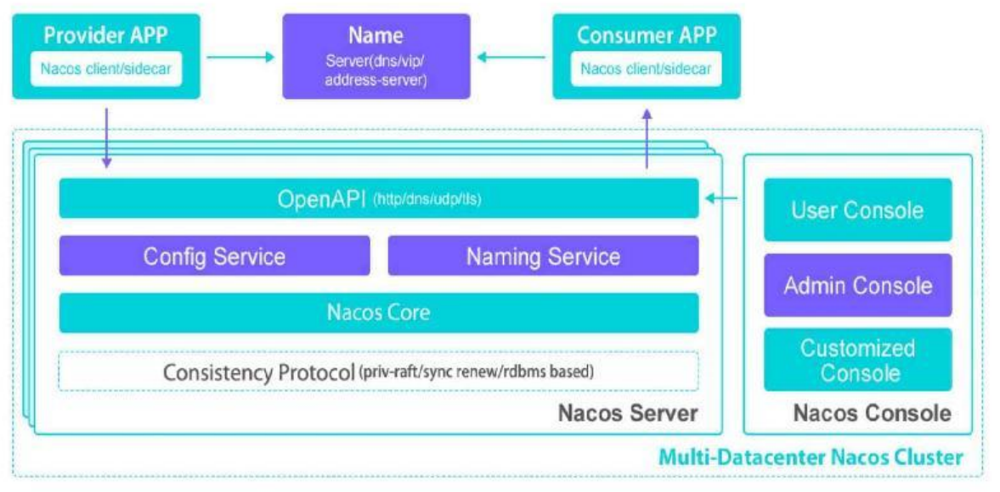
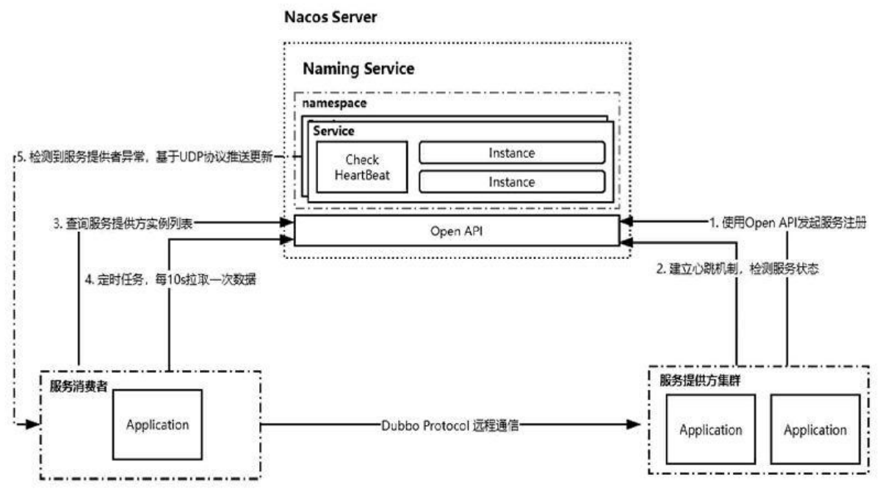
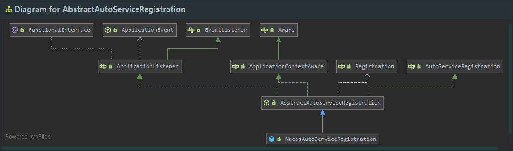
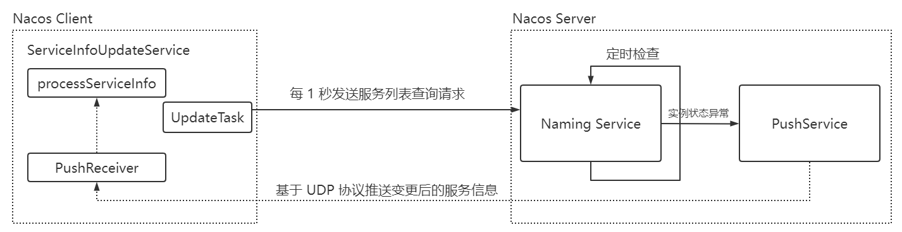

# Nacos

​		`Nacos`致力于解决微服务中的统一配置、服务注册与发现等问题。它提供了一组简单易用的特性集，帮助开发者快速实现动态服务发现、服务配置、服务元

数据及流量管理。

​		特性：

​				**服务发现和服务健康监测**：`Nacos`支持基于`DNS`和基`于RPC`的服务发现。服务提供者使用原生`SDK`、`OpenAPI`或一个独立的`Agent TODO`注册`Service`

​		后，服务消费者可以使用`DNS`或`HTTP&API`查找和发现服务。`Nacos`提供对服务的实时的健康检查，阻止向不健康的主机或服务实例发送请求。`Nacos`支持传

​		输层`(PING`或`TCP)`和应用层的健康检查。对于复杂的云环境和网络拓扑环境中服务的健康检查，`Nacos`提供了`agent`上报和服务端主动检测两种健康检查模

​		式。`Nacos`还提供了统一的健康检查仪表盘，帮助用户根据健康状态管理服务的可用性及流量。

​				**动态配置服务**：业务服务一般都会维护一个本地配置文件，然后把一些常量配置到这个文件中。这种方式在某些场景中会存在问题，比如配置需要变更

​		时要重新部署应用。而动态配置服务可以以中心化、外部化和动态化的方式管理所有环境的应用配置和服务配置，可以使配置管理变得更加高效和敏捷。配置

​		中心化管理让实现无状态服务变得更简单，让服务按需弹性扩展变得更容易。另外，`Nacos`提供了一个简洁易用的`UI`帮助用户管理所有服务和应用的配置。

​		`Nacos`还提供了包括配置版本跟踪、金丝雀发布、一键回滚配置及客户端配置更新状态跟踪在内的一系列开箱即用的配置管理特性，帮助用户更安全地在生

​		产环境中管理配置变更，降低配置变更带来的风险。

​				**动态`DNS`服务**：动态`DNS`服务支持权重路由，让开发者更容易地实现中间层负载均衡、更灵活的路由策略、流量控制，以及数据中心内网的简单`DNS`解

​		析服务。

​				**服务及其元数据管理**：`Nacos`可以使开发者从微服务平台建设的视角管理数据中心的所有服务及元数据，包括管理服务的描述、生命周期、服务的静态

​		依赖分析、服务的健康状态、服务的流量管理、路由及安全策略、服务的`SLA`及最重要的`metrics`统计数据。



​		`Provider APP`：服务提供者。

​		`Consumer APP`：服务消费者。

​		`Name Server`：通过`VIP(Vritual IP)`或者`DNS`的方式实现`Nacos`高可用集群的服务路由。

​		`Nacos Server`：`Nacos`服务提供者，里面包含的`Open API`是功能访问入口，`Config Service、Naming Service`是`Nacos`提供的配置服务、名字服务模块。

`Consistency Protocol`是一致性协议，用来实现`Nacos`集群节点的数据同步，这里使用的是`Raft`算法。

​		`Nacos Console`：`Nacos`控制台。

​		整体来说，服务提供者通过`VIP(Virtual IP)`访问`Nacos Server`高可用集群，基于`Open API`完成服务的注册和服务的查询。`Nacos Server`本身可以支持主

备模式，所以底层会采用数据一致性算法来完成从节点的数据同步。服务消费者也是如此，基于`Open API`从`Nacos Server`中查询服务列表。

```shell
startup.cmd -m standalone
```


## 注册中心原理

​		服务注册的功能主要体现在：

​				服务实例在启动时注册到服务注册表,并在关闭时注销。

​				服务消费者查询服务注册表，获得可用实例。

​				服务注册中心需要调用服务实例的健康检查`API`来验证它是否能够处理请求。



​		`ServiceRegistry`，它是`Spring Cloud`提供的服务注册的标准。集成到`Spring Cloud`中实现服务注册的组件，都会实现该接口：

```java
public interface ServiceRegistry<R extends Registration> {

	void register(R registration);

	void deregister(R registration);

	void close();

	void setStatus(R registration, String status);

	<T> T getStatus(R registration);
}
```

​		`NacosServiceRegistry`实现了`ServiceRegistry`接口将`Nacos`作为服务注册组件。`Spring Cloud`基于`Spring Boot`，而在`Spring Boot`启动时会获取类路径

下`META-INF/spring.factoriest`中`org.springframework.boot.autoconfigure.EnableAutoConfiguration`键对应的值，然后通过类上的条件将符合条件的类实例加

入到`IOC`容器中。`spring-cloud-commons`包的`META-INF/spring.factoriest`：

```properties
# AutoConfiguration
org.springframework.boot.autoconfigure.EnableAutoConfiguration=\
org.springframework.cloud.client.CommonsClientAutoConfiguration,\
org.springframework.cloud.client.ReactiveCommonsClientAutoConfiguration,\
...\
org.springframework.cloud.client.serviceregistry.AutoServiceRegistrationAutoConfiguration

```

```java
@Configuration(proxyBeanMethods = false)
@Import(AutoServiceRegistrationConfiguration.class)
@ConditionalOnProperty(value = "spring.cloud.service-registry.auto-registration.enabled",
		matchIfMissing = true)
public class AutoServiceRegistrationAutoConfiguration {

	@Autowired(required = false)
    // 注入实例
	private AutoServiceRegistration autoServiceRegistration;

	@Autowired
	private AutoServiceRegistrationProperties properties;

	@PostConstruct
	protected void init() {
		if (this.autoServiceRegistration == null && this.properties.isFailFast()) {
			throw new IllegalStateException("Auto Service Registration has "
					+ "been requested, but there is no AutoServiceRegistration bean");
		}
	}
}
```



​		`ApplicationListener`是`Spring`中的事件监听机制，用于监听某个指定的事件。而`AbstractAutoServiceRegistration`实现了该抽象方法，并且监听`WebServerInitializedEvent`事件`(`当`Webserver`初始化完成之后`)`：

```java
// AbstractAutoServiceRegistration 类
public void onApplicationEvent(WebServerInitializedEvent event) {
	bind(event); // 最终会调用 NacosServiceRegistry#register 方法进行服务注册
}
```


​		`Spring Cloud Alibaba Dubbo`集成`Nacos`时，服务的注册是依托`Dubbo`中的自动装配机制完成的。`spring-cloud-alibaba-dubbo`下的`META-`

`INF/spring.factories`文件中自动装配了一个和服务注册相关的配置类`DubboServiceRegistrationNonWebApplicationAutoConfiguration`：

```properties
org.springframework.boot.autoconfigure.EnableAutoConfiguration=\
com.alibaba.cloud.dubbo.autoconfigure.DubboServiceRegistrationNonWebApplicationAutoConfiguration,\
...
```

```java
@Configuration(proxyBeanMethods = false)
@ConditionalOnNotWebApplication
@ConditionalOnProperty(value = "spring.cloud.service-registry.auto-registration.enabled",
		matchIfMissing = true)
@AutoConfigureAfter(DubboServiceRegistrationAutoConfiguration.class)
@Aspect
public class DubboServiceRegistrationNonWebApplicationAutoConfiguration {

	private static final String REST_PROTOCOL = "rest";

	@Autowired
	private ServiceRegistry serviceRegistry; // 实现类为 NacosServiceRegistry

	@Autowired
	private Registration registration;

	private volatile Integer serverPort = null;

	private volatile boolean registered = false;

	@Autowired
	private DubboServiceMetadataRepository repository;

	@Around("execution(* org.springframework.cloud.client.serviceregistry.Registration.getPort())")
	public Object getPort(ProceedingJoinPoint pjp) throws Throwable {

		setServerPort();
		return serverPort != null ? serverPort : pjp.proceed();
	}

    // ApplicationStartedEvent 事件，该事件是在刷新上下文之后、调用 application 命令之前触发的。

	@EventListener(ApplicationStartedEvent.class)
	public void onApplicationStarted() {
		register();
	}

	private void register() {
		if (registered) {
			return;
		}
		serviceRegistry.register(registration); // 调用 NacosServiceRegistry#register 实现服务注册
		registered = true;
	}

	...
}
```

```java
// NacosServiceRegistry 类
public void register(Registration registration) {

		if (StringUtils.isEmpty(registration.getServiceId())) {
			log.warn("No service to register for nacos client...");
			return;
		}

		NamingService namingService = namingService();
		String serviceId = registration.getServiceId();
		String group = nacosDiscoveryProperties.getGroup();

		Instance instance = getNacosInstanceFromRegistration(registration);

		try {
			namingService.registerInstance(serviceId, group, instance);
			log.info("nacos registry, {} {} {}:{} register finished", group, serviceId,
					instance.getIp(), instance.getPort());
		}
		catch (Exception e) {
			if (nacosDiscoveryProperties.isFailFast()) {
				log.error("nacos registry, {} register failed...{},", serviceId,
						registration.toString(), e);
				rethrowRuntimeException(e);
			}
			else {
				log.warn("Failfast is false. {} register failed...{},", serviceId,
						registration.toString(), e);
			}
		}
}
```

​		`namingService.registerInstance()`方法的实现，主要逻辑：

​				通过`beatReactor.addBeatInfo`创建心跳信息实现健康检测，`Nacos Server`必须要确保注册的服务实例是健康的，而心跳检测就是服务健康检测的手

​		段。

​				实现服务注册。

```java
// BeatReactor 类
public void addBeatInfo(String serviceName, BeatInfo beatInfo) {
        NAMING_LOGGER.info("[BEAT] adding beat: {} to beat map.", beatInfo);
        String key = buildKey(serviceName, beatInfo.getIp(), beatInfo.getPort());
        BeatInfo existBeat;
        //fix #1733
        if ((existBeat = dom2Beat.remove(key)) != null) {
            existBeat.setStopped(true);
        }
        dom2Beat.put(key, beatInfo);
    	// 定时发送心跳包，executorService 是 ScheduledThreadPoolExecutor 线程池的实例
        executorService.schedule(new BeatTask(beatInfo), beatInfo.getPeriod(), TimeUnit.MILLISECONDS);
        MetricsMonitor.getDom2BeatSizeMonitor().set(dom2Beat.size());
}
```

​		从上述代码看，所谓心跳机制就是客户端通过`schedule`定时向服务端发送一个数据包，然后启动一个线程不断检测服务端的回应，如果在设定时间内没有收

到服务端的回应，则认为服务器出现了故障。`Nacos`服务端会根据客户端的心跳包不断更新服务的状态。


## 服务注册原理

​		对于服务注册，`Nacos`对外提供的服务接口请求地址为`nacos/vl/ns/instance`，实现代码在`nacos-naming`模块下的`InstanceController`类中：

```java
/**

*/
@RestController
@RequestMapping(UtilsAndCommons.NACOS_NAMING_CONTEXT + UtilsAndCommons.NACOS_NAMING_INSTANCE_CONTEXT)
public class InstanceController {
    @CanDistro
	@PostMapping
	@Secured(action = ActionTypes.WRITE)
	public String register(HttpServletRequest request) throws Exception {
         // 获取命令空间 ID
		final String namespaceId = WebUtils.optional(request, CommonParams.NAMESPACE_ID, Constants.DEFAULT_NAMESPACE_ID);
         // 获取服务名
		final String serviceName = WebUtils.required(request, CommonParams.SERVICE_NAME);
		NamingUtils.checkServiceNameFormat(serviceName);
        
		final Instance instance = HttpRequestInstanceBuilder.newBuilder()
                .setDefaultInstanceEphemeral(switchDomain.isDefaultInstanceEphemeral()).setRequest(request).build();
        
		getInstanceOperator().registerInstance(namespaceId, serviceName, instance);
		NotifyCenter.publishEvent(new NamingTraceEvent.RegisterInstanceTraceEvent(System.currentTimeMillis(), "",
                false, namespaceId, NamingUtils.getGroupName(serviceName), NamingUtils.getServiceName(serviceName),
                instance.toInetAddr()));
		return "ok";
	}
    ...
}
```

```java
// ServiceManager 类
public void registerInstance(String namespaceId, String serviceName, Instance instance) throws NacosException {
        // 创建一个空服务，最终调用 createServiceIfAbsent 方法
        createEmptyService(namespaceId, serviceName, instance.isEphemeral());
        // 从缓存中获取服务对象
        Service service = getService(namespaceId, serviceName);
        
        checkServiceIsNull(service, namespaceId, serviceName);
        // 添加服务实例
        addInstance(namespaceId, serviceName, instance.isEphemeral(), instance);
}

public void createServiceIfAbsent(String namespaceId, String serviceName, boolean local, Cluster cluster)
            throws NacosException {
    	// 从缓存中获取服务对象
        Service service = getService(namespaceId, serviceName);
    	// 没有，则新建服务对象，并加入缓存
        if (service == null) {
            
            Loggers.SRV_LOG.info("creating empty service {}:{}", namespaceId, serviceName);
            
            service = new Service();
            service.setName(serviceName);
            service.setNamespaceId(namespaceId);
            service.setGroupName(NamingUtils.getGroupName(serviceName));
            // now validate the service. if failed, exception will be thrown
            service.setLastModifiedMillis(System.currentTimeMillis());
            service.recalculateChecksum();
            if (cluster != null) {
                cluster.setService(service);
                service.getClusterMap().put(cluster.getName(), cluster);
            }
            service.validate();
            
            putServiceAndInit(service);
            if (!local) {
                addOrReplaceService(service);
            }
        }
}

private void putServiceAndInit(Service service) throws NacosException {
    	// 将服务对象加入缓存
        putService(service);
        service = getService(service.getNamespaceId(), service.getName());
    	// 建立心跳检测机制
        service.init();
    	// 实现数据一致性的监听
        consistencyService
                .listen(KeyBuilder.buildInstanceListKey(service.getNamespaceId(), service.getName(), true), service);
        consistencyService
                .listen(KeyBuilder.buildInstanceListKey(service.getNamespaceId(), service.getName(), false), service);
        Loggers.SRV_LOG.info("[NEW-SERVICE] {}", service.toJson());
}
```


## 服务提供者地址查询

```java
// InstanceController 类
@GetMapping("/list")
@Secured(action = ActionTypes.READ)
public Object list(HttpServletRequest request) throws Exception {
        
        String namespaceId = WebUtils.optional(request, CommonParams.NAMESPACE_ID, Constants.DEFAULT_NAMESPACE_ID);
        String serviceName = WebUtils.required(request, CommonParams.SERVICE_NAME);
        NamingUtils.checkServiceNameFormat(serviceName);
        
        String agent = WebUtils.getUserAgent(request);
        String clusters = WebUtils.optional(request, "clusters", StringUtils.EMPTY);
        String clientIP = WebUtils.optional(request, "clientIP", StringUtils.EMPTY);
        int udpPort = Integer.parseInt(WebUtils.optional(request, "udpPort", "0"));
        boolean healthyOnly = Boolean.parseBoolean(WebUtils.optional(request, "healthyOnly", "false"));
        String app = WebUtils.optional(request, "app", StringUtils.EMPTY);

        Subscriber subscriber = new Subscriber(clientIP + ":" + udpPort, agent, app, clientIP, namespaceId, serviceName,
                udpPort, clusters);
        return getInstanceOperator().listInstance(namespaceId, serviceName, subscriber, clusters, healthyOnly);
}
```

```java
// InstanceOperatorServiceImpl 类
public ServiceInfo listInstance(String namespaceId, String serviceName, Subscriber subscriber, String cluster,
            boolean healthOnly) throws Exception {
        ClientInfo clientInfo = new ClientInfo(subscriber.getAgent());
        String clientIP = subscriber.getIp();
        ServiceInfo result = new ServiceInfo(serviceName, cluster);
        Service service = serviceManager.getService(namespaceId, serviceName);
        long cacheMillis = switchDomain.getDefaultCacheMillis();
        
        // now try to enable the push
        try {
            if (subscriber.getPort() > 0 && pushService.canEnablePush(subscriber.getAgent())) {
                subscriberServiceV1.addClient(namespaceId, serviceName, cluster, subscriber.getAgent(),
                        new InetSocketAddress(clientIP, subscriber.getPort()), pushDataSource, StringUtils.EMPTY,
                        StringUtils.EMPTY);
                cacheMillis = switchDomain.getPushCacheMillis(serviceName);
            }
        } catch (Exception e) {
            Loggers.SRV_LOG.error("[NACOS-API] failed to added push client {}, {}:{}", clientInfo, clientIP,
                    subscriber.getPort(), e);
            cacheMillis = switchDomain.getDefaultCacheMillis();
        }
        
        if (service == null) {
            if (Loggers.SRV_LOG.isDebugEnabled()) {
                Loggers.SRV_LOG.debug("no instance to serve for service: {}", serviceName);
            }
            result.setCacheMillis(cacheMillis);
            return result;
        }
        
        checkIfDisabled(service);
        // 获取指定服务下的所有实例 IP
        List<com.alibaba.nacos.naming.core.Instance> srvedIps = service
                .srvIPs(Arrays.asList(StringUtils.split(cluster, StringUtils.COMMA)));
        
        // filter ips using selector:
        if (service.getSelector() != null && StringUtils.isNotBlank(clientIP)) {
            srvedIps = selectorManager.select(service.getSelector(), clientIP, srvedIps);
        }
        
        if (CollectionUtils.isEmpty(srvedIps)) {
            
            if (Loggers.SRV_LOG.isDebugEnabled()) {
                Loggers.SRV_LOG.debug("no instance to serve for service: {}", serviceName);
            }
            
            result.setCacheMillis(cacheMillis);
            result.setLastRefTime(System.currentTimeMillis());
            result.setChecksum(service.getChecksum());
            return result;
        }
        
        long total = 0;
        Map<Boolean, List<com.alibaba.nacos.naming.core.Instance>> ipMap = new HashMap<>(2);
        ipMap.put(Boolean.TRUE, new ArrayList<>());
        ipMap.put(Boolean.FALSE, new ArrayList<>());
        // 遍历
        for (com.alibaba.nacos.naming.core.Instance ip : srvedIps) {
            // remove disabled instance:
            if (!ip.isEnabled()) {
                continue;
            }
            ipMap.get(ip.isHealthy()).add(ip);
            total += 1;
        }
        
        double threshold = service.getProtectThreshold();
        List<Instance> hosts;
        if ((float) ipMap.get(Boolean.TRUE).size() / total <= threshold) {
            
            Loggers.SRV_LOG.warn("protect threshold reached, return all ips, service: {}", result.getName());
            result.setReachProtectionThreshold(true);
            hosts = Stream.of(Boolean.TRUE, Boolean.FALSE).map(ipMap::get).flatMap(Collection::stream)
                    .map(InstanceUtil::deepCopy)
                    // set all to `healthy` state to protect
                    .peek(instance -> instance.setHealthy(true)).collect(Collectors.toCollection(LinkedList::new));
        } else {
            result.setReachProtectionThreshold(false);
            hosts = new LinkedList<>(ipMap.get(Boolean.TRUE));
            if (!healthOnly) {
                hosts.addAll(ipMap.get(Boolean.FALSE));
            }
        }
        
        result.setHosts(hosts);
        result.setCacheMillis(cacheMillis);
        result.setLastRefTime(System.currentTimeMillis());
        result.setChecksum(service.getChecksum());
        return result;
}
```


## 服务地址动态感知

​		`Nacos`客户端有一个`ServiceInfoUpdateService`类，它的功能是实现服务的动态更新，基本原理是：

​				客户端发起事件订阅后，在`ServiceInfoUpdateService`中有一个`UpdateTask`线程，每`1s`发送一次`Pull`请求，获得服务端最新的地址列表。

​				对于服务端，它和服务提供者的实例之间维持了心跳检测，一旦服务提供者出现异常，则会发送一个`Push`消息给`Nacos`客户端，也就是服务消费者。

​				服务消费者收到请求之后，使用`ServiceInfoHolder`中提供的`processServiceInfo`解析消息，并更新本地服务地址列表。




