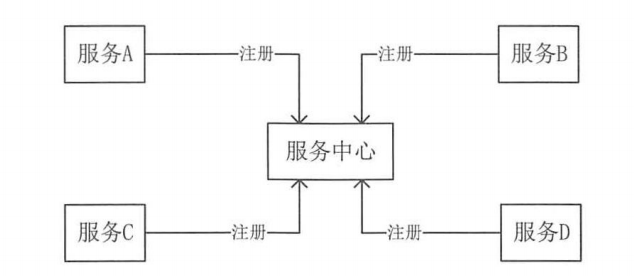

# **Spring Cloud**

​		微服务是系统架构上的一种设计风格，它的主旨是将一个原本独立的系统拆分成多个小型服务，这些小型服务都在各自独立的进程中运行，服务之间通过基于

`HTTP`的`RESTful API`进行通信协作。被拆分成的每一个小型服务都围绕着系统中的某一项或一些耦合度较高的业务功能进行构建，并且每个服务都维护着自身的

数据存储、业务开发、自动化测试案例以及独立部署机制。由于有了轻量级的通信协作基础，所以这些微服务可以使用不同的语言来编写。


# actuator

​		`Spring-boot-starter-actuator`模块能够自动为`Spring Boot`构建的应用提供一些列用于监控的端点。同时，`Spring Cloud`在实现各个微服务组件的时候，

进一步对该模块做了不少扩展。

```xml
		<dependency>
            <groupId>org.springframework.boot</groupId>
            <artifactId>spring-boot-starter-actuator</artifactId>
        </dependency>
```

```properties
management:
  security:
    enabled: false
  endpoint:
    health:
      show-details: always
  endpoints:
    web:
      exposure:
        include: "*"
```

## 原生端点

​		根据端点的作用分为三大类：

​				应用配置类：获取应用程序中加载的应用配置，环境变量，自动化配置报告等与`Spring Boot`应用密切相关的配置类信息。

​				度量指标类：获取应用程序运行过程中用于监控的度量指标。

​				操作控制类：提供了对应用的关闭等操作类功能。

### 应用配置类

| url          | 说明                                                    |
| ------------ | ------------------------------------------------------- |
| /autoconfig  | 获取应该用的自动化配置报告                              |
| /beans       | 获取应用上下文中创建的所有Bean                          |
| /configprops | 获取应用中配置的属性信息报告                            |
| /env         | 获取应用所有可用的环境属性报告，包括环境变量，JVM属性等 |
| /mappings    | 返回所有Spring  MVC的控制器映射关系报告                 |
| /info        | 返回一些应用自定义的信息                                |


### 度量指标类

| url      | 说明                           |
| -------- | ------------------------------ |
| /metrics | 返回当前应用的各类重要度量指标 |
| /health  | 获取应用的各类健康指标信息     |
| /dump    | 用来暴露程序硬性中的线程信息   |
| /trace   | 返回基本的HTTP跟踪信息         |


### 操作控制类

|      url| 说明     |
| ---- | ---- |
|      /shutdown| 用来关闭应用（需要配置endpoints.shutdown.enabled=true）      |

# Spring Cloud Eureka

```xml
<!-- Eureka 客户端 -->
<dependency>
            <groupId>org.springframework.cloud</groupId>
            <artifactId>spring-cloud-starter-netflix-eureka-client</artifactId>
</dependency>
<!-- Eureka 服务器 -->
<dependency>
            <groupId>org.springframework.cloud</groupId>
            <artifactId>spring-cloud-starter-netflix-eureka-server</artifactId>
</dependency>
```


​		`Spring Cloud Eureka`是`Spring Cloud Netflix`微服务套件中的一部分，它基于`Netflix Eureka`做了二次封装，主要负责完成微服务架构中的服务治理功

能。

​		服务治理：微服务架构中最为核心和基础的模块，主要用来实现各个微服务实例的自动化注册与发现。


## 服务注册

​		服务治理框架中，通常都会构建一个注册中心，每个服务单元向注册中心登记自己提供的服务，将主机与端口号、版本号、通信协议等一些附加信息告知注册

中心，注册中心按服务名分类组织服务清单。服务注册中心还需要以心跳的方式去监测清单中的服务是否可用若不可用需要从服务清单中剔除，达到排除故障服务

的效果。


## 服务发现

​		由于在服务治理框架下运作，服务间的调用不再通过指定具体的实例地址来实现，而是通过向服务名发起请求调用实现。所以，服务调用方在调用服务提供方

接口的时候，并不知道具体的服务实例位置。因此，调用方需要向服务注册中心咨询服务，并获取所有服务的实例清单，以实现对具体服务实例的访问。


## Netflix Eureka

​		`Spring Cloud Eureka`，使用`Netflix Eureka`来实现服务注册与发现，它既包含了服务端组件，也包含了客户端组件，并且服务端与客户端均采用`Java`编

写，所以`Eureka`主要适用于通过`Java`实现的分布式系统，或是与`JVM`兼容语言构建的系统。但是，由于`Eureka`服务端的服务治理机制提供了完备的`RESTful `

`API`，所以它也支持将非`Java`语言构建的微服务应用纳入`Eureka`的服务治理体系中来。只是在使用其他语言平台的时候，需要自己来实现 `Eureka`的客户端程

序。

​		`Eureka`服务端，也称为服务注册中心。它同其他服务注册中心一样，支持高可用配置。它依托于强一致性提供良好的服务实例可用性，可以应对多种不同的

故障场景。如果`Eureka`以集群模式部署，当集群中有分片出现故障时，那么`Eureka`就转入自我保护模式。它允许在分片故障期间继续提供服务的发现和注册，当

故障分片恢复运行时，集群中的其他分片会把它们的状态再次同步回来。

​		`Eureka`客户端，主要处理服务的注册与发现。客户端服务通过注解和参数配置的方式，嵌入在客户端应用程序的代码中，在应用程序运行时，`Eureka`客户端

向注册中心注册自身提供的服务并周期性地发送心跳来更新它的服务租约。同时，它也能从服务端查询当前注册的服务信息并把它们缓存到本地并周期性地刷新服

务状态。


## 详解

### 注册

​		服务提供者在启动的时候会通过发送`REST`请求的方式将自己注册到`Eureka Server`上，同时带上了自身服务的一些元数据信息。`Eureka Server`接收到这个

`REST`请求之后，将元数据信息存储在一个双层结构`Map`中，其中第一层的`key`是服务名，第二层的`key`是具体服务的实例名。


### 同步

​		将多个提供相同服务的服务提供者注册到不同的服务注册中心时，此时，它们的信息被多个服务注册中心所维护。当服务提供者发送注册请求到其中任何一个

注册中心时，这个注册中心将该请求转发给集群中相连的其他注册中心，从而实现注册中心之间的服务同步。

​		通过服务同步，多个服务提供者的服务信息就可以通过多个注册中心中的任意一台获取到。


### 续约

​		在注册完服务之后，服务提供者会维护一个心跳用来持续告诉`Eureka Server`：我还活着，以防止`Eureka Server`的剔除任务将该服务实例从服务列表中排除

出去，我们称该操作为服务续约。

```yaml
eureka:
  instance:
    lease-expiration-duration-in-seconds: 90   # 定义服务失效时间，默认90秒
    lease-renewal-interval-in-seconds: 30	# 定义服务续约任务的调用间隔时间，默认30秒
```


### 获取

​		启动一个服务消费者的时候，它会发送一个`REST`请求给服务注册中心，来获取上面注册的服务的清单，为了性能考虑，`Eureka Server`会维护一份只读的服

务清单来返回给客户端，同时该缓存清单会每隔30秒更新一次。

```yaml
eureka:
  client:
    fetch-registry: true # 必须确保 true
    registry-fetch-interval-seconds: 30 # 设置缓存清单的更新时间，默认为30秒
```


### 调用

​		服务消费者在获取服务清单后，通过服务名可以获得具体提供服务的实例名和该实例的元数据信息。因为有这些服务实例的详细信息，所以客户端可以根据自

己的需要决定具体调用哪个实例，在`Ribbon`中会默认采用轮询的方式进行调用，从而实现客户端的负载均衡。

​		对于访问实例的选择，`Eureka`中有`Region`和`Zone`的概念，一个`Region`中可以包含多个`Zone`，每个服务客户端需要被注册到一个`Zone`中，所以每个客户

端对应一个`Region`和一个`Zone`。在进行服务调用的时候，优先访问同处一个`Zone`中的服务提供方，若访问不到，就访问其他的`Zone`。


### 下线

​		在系统运行过程中必然会面临关闭或重启服务的某个实例的情况，在服务关闭期间，我们自然不希望客户端会继续调用关闭了的实例。所以在客户端程序中，

当服务实例进行正常的关闭操作时，它会触发一个服务下线的`REST`请求给`Eureka Server`，告诉服务注册中心：我要下线了。服务端在接收到请求之后，将该服

务状态置为下线，并把该下线事件传播出去。


### 失效剔除

​		有些时候，我们的服务实例并不一定会正常下线，可能由于内存溢出、网络故障等原因使得服务不能正常工作，而服务注册中心并未收到服务下线的请求。为

了从服务列表中将这些无法提供服务的实例剔除，`Eureka Server`在启动的时候会创建一个定时任务，默认每隔一段时间（默认为60秒）将当前清单中超时（默认

为90秒)剔除出去。


### 自我保护

​		服务注册到`Eureka Server`之后,会维护一个心跳连接,告诉`Eureka Server`自己还活着。`Eureka Server`在运行期间,会统计心跳失败的比例在15分钟之内是否

低于85%，如果出现低于的情况，`EurekaServer`会将当前的实例注册信息保护起来，让这些实例不会过期，尽可能保护这些注册信息。但是，在这段保护期间内

实例若出现问题，那么客户端很容易拿到实际已经不存在的服务实例，会出现调用失败的情况，所以客户端必须要有容错机制，比如可以使用请求重试、断路器等

机制。


```yaml
eureka:
  instance:
    instance-id:   # 配置实例名 
    metadata-map:  # 配置自定义元数据
      zone: sichuan
    status-page-url-path:  # 配置状态页的 url 默认采用 actuator 模块提供的 /info端点
    health-check-url-path: # 配置健康检查页的 url ，默认采用 actuator模块提供的 /health 端点（开启了 healthcheck 功能），必须确保此地址是一个注册中心能访问到的地址，如果设置了 management.conetxt-path 属性，则这两个属性的值分别为：${management.conetxt-path}/info、${management.conetxt-path}/health，如果客户端以HTTPS的方式来暴露服务和监控端点，则属性值为：https://${eureka.instance.hostname}/info，https://${eureka.instance.hostname}/health，homePageUrl的值为：https://${eureka.instance.hostname}/
  client:
  	healthcheck:
      enabled: true  # 使用此配置需要引入 actuator 模块，配置之后，健康检查将会使用 actuator 提供的/health端点，这是比心跳检测更加全面的健康维护，心跳检测只能检测到客户端进程是否在运行，并不能检测到外部资源依赖是否正常。
    register-with-eureka: true  # 是否将服务注册到注册中心
    service-url:
      defaultZone: http://localhost:8080/eureka/  # 默认注册中心地址   
    
```


# WebFlux

​		`WebFlux`是从`Spring Framework 5.0`开始引入的反应式`Web`框架。与`Spring MVC`不同，它不需要`Servlet API`，完全异步且无阻塞，并通过`Reactor`实现

`Reactive Streams`规范。

​		`WebFlux`可以在资源有限的情况下提高系统的吞吐量和伸缩性（不是提高性能)。这意味着，在资源相同的情况下，`WebFlux`可以比`MVC`处理更多的请求`(`不

是业务`)`。

​		`WebFlux`除支持`RESTful Web`服务外，还可以用于提供动态`HTML`内容。

# Consul

## 服务治理

​		在没有进行服务治理前,服务之间的通信是通过服务间直接相互调用来实现的。微服务系统中服务众多，且提供功能相同的服务也会被部署很多以实现负载均

衡，会导致服务间的相互调用非常不便。


​		当有了服务中心后：



​		1、服务提供者在服务中心完成注册。

​		2、服务消费者从服务中心获取注册过的服务的列表，并根据特定算法从获取到的服务列表中选择需要的某个服务来调用。


## CAP

​		C：即一致性：保证读操作能返回最新的结果。在支付场景中，对一致性有较高的要求。但在日志记录场中，对一致性的要求就较低，可以牺牲一致性来换取

可用性。

​		A：即可用性：非故障的节点应在合理的时间内返回合理的响应(不是错误和超时的响应)。可用性保证系统一直处于能正常使用的状态。

​		P：即分区容错性：在分布式系统中，要能保证在部分机器断网或宕机的情况下有其他的服务器能继续提供服务。


## 三种场景

​		一个分布式系统一定不能同时满足C、A和P，所以存在如下三种场景：

​				1、 CP(一致性+分区容错性)：牺牲可用性，保证一致性。一致性要求较高的场景有支付、抢红包等。

​				2、AP (可用性+分区容错性)：即牺牲一致性保证可用性，这样能提高用户体验和性能等。比如日志记录、数据投递、存储系统配置等场景。

​				3、CA(一致性+可用性)：如果不能保证分区容错性，一旦产生断网宕机等意外情况，则系统就会无法工作。目前很少有场景会完全不考虑分区容错性。

​		由于分区容错性Р在分布式系统中是必须要保证的，因此我们只能在`A`和`C`之间进行权衡。


​		`Spring Cloud Commons`通过封装`DiscoveryClient`接口来提供一个简单的接口，以发现客户端。`Spring Cloud`会先寻找`DiscoveryClient`接口的实现，然后

将它用作服务发现。


```xml
<!-- https://mvnrepository.com/artifact/org.springframework.cloud/spring-cloud-starter-consul-discovery -->
<dependency>
    <groupId>org.springframework.cloud</groupId>
    <artifactId>spring-cloud-starter-consul-discovery</artifactId>
</dependency>
```

​		`Agent`：在`Consul`集群的每个成员上都会运行`Agent`，`Agent`是一个守护进程。`Agent`有`Client`和`Server`模式。`Agent`能运行`DNS`或者`HTTP`接口，并负

责在运行时检查和保持服务同步。

​		`Client`：一个转发所有`RPC`到`Server`的代理。这个`Client`是相对无状态的`Client`唯一执行的后台活动是加入`LAN gossip`池。它只需要较低的资源开销，

并且仅消耗少量的网络带宽。

​		`Server`：一个具有扩展功能的代理，它的功能包括参与`Raft`选举、维护集群状态、响应`RPC`查询、与其他数据中心交互`WAN gossip`、转发查询给`Leader`

或者远程数据中心。它在局域网内与本地客户端进行通信，通过广域网与其他数据中心进行通信。`Server`保存集群中的配置信息，每个数据中心的`Server`数量推

荐为`3~5`个。

​		`DataCenter`：一个私有的、低延迟和高带宽的一个网络环境。

​		`Consensus`：用来表明`Server`间就`Leader`选举和事务的顺序达成一致。由于这些事务都被应用到有限状态机上，所以`Consensus`代表复制状态机的一致性。

​		`Gossip`：用于实现基于`UDP`的随机点到点的通信。

​		`LAN Gossip`：它包含所有位于同一个局域网或者同一个数据中心的所有节点

​		`WAN Gossip`：它只包含分布在不同数据中心的所有节点。数据中心间通常采用因特网或者广域网进行通信。

​		`RPC`：远程过程调用。这是一个允许`Client`请求`Server`的请求`/`响应机制。


​		1、服务提供者在启动时向`Consul`发送一个`POST`请求，告诉`Consul`自己的IP地址和端口号等。

​		2、`Consul`在接收到服务提供者的注册后，每隔`10s(`默认`)`会向服务提供者发送一个健康检查的请求，以检验其是否健康。

​		3、服务消费者在调用服务前，会先从`Consul中`获取一个存储服务提供者`IP`地址和端口号的临时表，然后发送请求给服务提供者。

​		4、`Consul`中的服务提供者临时表每隔`10s`更新一次，其中只包含通过了健康检查的服务提供者。


### 集群


​		每个数据中心中`Client`和`Server`是混合的，一个数据中心的`Server`数量最好是`3~5`台，并不限制`Client`的数量。`Consul`要求同一个数据中心的所有节点

都必须采用`Gossip`协议：

​				1、不需要在`Client`上配置`Server`的`IP`地址。

​				2、检测节点故障工作采用的是分布式，而不是放在`Server`上。

​				3、便于消息层通知事件。

​		数据中心的`Leader`是一个有额外工作的`Server`，它是由所有`Server`选出的。`Leader`负责处理所有的查询和事务。因为有一致性协议要求，所以事务也必

须被复制到所有其他的节点中。每个数据中心的`Server`都是`Raft`节点集合的一部分。一个非`Leader`的`Server`在收到一个`RPC`请求后会将请求转发给集群

`Leader`。

# Spring Cloud Ribbon

​		`Spring Cloud Ribbon`是一个基于`HTTP`和`TCP`的客户端负载均衡工具，它基于`Netflix Ribbon`实现。通过`Spring Cloud`的封装，可以让我们轻松地将面向

服务的`REST`模板请求自动转换成客户端负载均衡的服务调用。


​		硬件负载均衡的设备或是软件负载均衡的软件模块都会维护一个下挂可用的服务端清单，通过心跳检测来剔除故障的服务端节点以保证清单中都是可以正常访

问的服务端节点。当客户端发送请求到负载均衡设备的时候，该设备按某种算法（比如线性轮询、按权重负载、按流量负载等）从维护的可用服务端清单中取出一

台服务端的地址，然后进行转发。

​		客户端负载均衡和服务端负载均衡最大的不同点在于上面所提到的服务清单所存储的位置。在客户端负载均衡中，所有客户端节点都维护着自己要访问的服务

端清单，而这些服务端的清单来自于服务注册中心，同服务端负载均衡的架构类似，在客户端负载均衡中也需要心跳去维护服务端清单的健康性，只是这个步骤需

要与服务注册中心配合完成。

​		使用`Spring Cloud Ribbon`进行客户端负载均衡只需要两步：

​				1、服务提供者只需要启动多个服务实例并注册到一个注册中心或是多个相关联的服务注册中心。

​				2、服务消费者直接通过调用被`@LoadBalanced`注解修饰过的`RestTemplate`来实现面向服务的接口调用。

## 组件

​		1、IClientConfig

​				它用于读取配置，其默认值是`DefaultConfiglmpl`。

​		2、ServerList

​				它用于获取服务提供者地址列表。它既可以是一组固定的地址，也可以是从注册中心中定期查询出的服务提供者地址列表。

​		3、ServerListFilter

​				它用于在原始的服务提供者地址列表中使用一定策略过滤一部分不符合条件的地址（仅当使用动态`ServerList`时使用）。

​		4、IRule

​				它负责处理负载均衡的规则，默认通过`ZoneAvoidanceRule`选择实例。

​				工作流程：

​						（1）通过`ServerList`获取所有可用的服务提供者地址列表。

​						（2）通过`ServerListFilter`过滤一部分服务提供者地址。

​						（3）在剩下的地址中通过`IRule`选出一台服务器。

​		5、Iping

​				它用来筛选掉`Ping`不通的实例。

​		6、ILoadBalancer

​				它是`Ribbon`的入口。

​		7、 ServerListUpdater

​				它用于更新`ServerList`。当服务中心上服务提供者实例的个数发生变化时，`Ribbon`里的`ServerList`会根据默认值`PollingServerListerUpdate`定时更

​		新服务提供者地址列表。


## 负载均衡器

​		`Spring Cloud`中定义了`LoadBalancerClient`为负载均衡器接口，针对`Ribbon`实现了`RibbonLoadBalancerClient`，通过`Ribbon`的 `LoadBalancer`接口来具体

实现客户端负载均衡。

​		`LoadBalancerClient`在初始化时：执行`execute()`方法，会通过`ILoadBalancer`从服务注册中心获取服务提供者地址列表，并且每**10s**向服务提供者发送一

次`ping`，来判断服务的可用性。如果服务的可用性发生了改变，或者服务数量和之前的不一致，则`RibbonLoadBalancerClient`会从注册中心更新服务提供者地址

列表。`LoadBalancerClient`有了这些服务提供者地址列表，即可根据具体的`IRule`来进行负载均衡。

```java
public interface ILoadBalancer {

    // 向负载均衡器中增加新的服务提供者地址列表。
	public void addServers(List<Server> newServers);
	
    // 从服务提供者地址列表中挑选一个具体的服务实例
	public Server chooseServer(Object key);
	
	// 标示某个服务实例暂停服务
	public void markServerDown(Server server);
	
    @Deprecated
	public List<Server> getServerList(boolean availableOnly);

	// 获取可用的服务提供者地址列表
    public List<Server> getReachableServers();

    // 获取所有的服务提供者地址列表
	public List<Server> getAllServers();
}
```


​		如果只想自定义某个`Ribbon`客户端的配置，则必须防止特定的被注解`@ComponentScan`扫描，否则它会对所有的`Ribbon`客户端生效。	


## 9大负载均衡策略

​		`Ribbon`通过`IRule`接口定义负载均衡策略。`IRule`接口是负载均衡策略的父接口，`AbstractLoadBalancerRule`继承自`IRule`，是一个负载均衡策略的抽象

类，其主要定义了一个负载均衡器`ILoadBalancer`。`LoadBalancer`根据负载均衡器中的信息来选择服务实例。定义`lRule`的主要目的是辅助均衡策略选取合适的

服务实例，其默认采用的是线性轮询策略。

### 线性轮询策略

​		`BaseLoadBalancer`负载均衡器中默认采用线性轮询负载均衡策略（`RoundRobinRule` )。其工作流程为：

​				1、`RoundRobinRule`类的`choose`方法初始化一个计数器`count`。

​				2、`incrementAndGetModulo()`方法获取一个下标`(`是先加1，然后和服务清单总数取模获取到的，不会越界`)`，是一个不断自增长的数。

​				3、`chooseServer(Object key)`方法拿着下标去服务列表中取服务,每次循环计数器都会加1。如果连续10次都没有取到服务，则会报`No available 		`

​		`alive servers after 10 tries from loadbalancer.`警告。


### 重试策略

​		重试策略使用在`RetryRule`类中定义的`choose(ILoadBalancer lb, Object key)`方法来选择一个服务实例。

​		`choose()`方法也是采用`RoundRobinRule`中的`choose()`方法来选择一个服务实例的。在选择实例时，

​				如果选到的服务实例正常，则返回数据。

​				如果选到的服务实例为`null`或失效，则`choose()`方法会在失效时间前不断地进行重试。

​				如果超过了失效时间还是没取到，则返回一个`null`。


### 加权响应时间策略

​		`WeightedResponseTimeRule`类`RoundRobinRule`的一个子类，它对`RoundRobinRule`的功能进行了扩展。它根据每一个服务实例的运行情况先计算出该服务实例

的一个权重，然后根据权重进行服务实例的挑选，这样能够调用到更优的服务实例。

​		在这个策略下，每`30s`计算一次各个服务实例的响应时间，以响应时间来计算权重。平均响应时间越短则权重越高，权重越高被选中的概率越高，反之则被

选中的概率较低。

​		`WeightedResponseTimeRule`中有一个名叫`DynamicServerWeightTask`的定时任务。它是一个后台线程，定期地从`status`里面读取响应时间，用来为每个服务

实例计算权重。


### 随机策略

​		随机策略用来随机选择可用服务实例。其工作流程为：

​				1、负载均衡通过`upList()`和`allList()`方法获得可用服务实例列表,然后初始化了一个`Random`对象以生成一个不大于服务实例总数的随机数。

​				2、`choose()`方法将该随机数作为下标获取一个服务实例。轮询`index`，选择`index`对应位置的服务实例。


### 客户端配置启用线性轮询策略

​		继承该策略默认的`choose()`方法就能实现线性轮询机制。该策略没有特殊的处理逻辑，一般不直接使用它。


### 最空闲策略

​		该策略是逐个考察各服务实例，然后选择一个最小的并发请求的服务实例来提供服务。`BestAvailableRule`继承自`ClientConfigEnabledRoundRobinRule`类，

最空闲策略的工作流程如下：

​				1、根据在`loadBalancerStats()`方法中保存的服务实例的状态信息来过滤失效的服务实例。

​				2、判断`loadBalancerStats`是否为空。

​						如果`loadBalancerStats`不为空，则找出并发请求最小的服务实例来使用。

​						如果`loadBalancerStats`为空，则`BestAvailableRule`类将采用它的父类，即`ClientConfigEnabledRoundRobinRule`的服务选取策略（线性轮询)。


### 过滤线性轮询策略

​		`PredicateBasedRule`类是`ClientConfigEnabledRoundRobinRule`类的一个子类，它通过内部定义的一个过滤器过滤出一部分服务实例清单，然后用线性轮询的

方式从过滤出来的服务实例清单中选取一个服务实例。


### 区域感知轮询策略

​		该策略以区域、可用服务器为基础，选择服务实例并对服务实例进行分类。`ZoneAvoidanceRule`类是`PredicateBasedRule`类的一个实现类，它有一个组合过

滤条件。`ZoneAvoidanceRule`类中的过滤条件是以`ZoneAvoidancePredicate()`方法为主过滤条件和以`AvailabilityPredicate()`方法为次过滤条件组成的。在过滤

成功后，继续采用线性轮询的方式从过滤结果中选择出一个服务实例。


### 可用性过滤策略(

​		该策略根据服务状态（宕机或繁忙）来分配权重，过滤掉那些因为一直连接失败或高并发的服务实例。它使用一个`AvailabilityPredicate()`方法来包含过滤

逻辑，其本质是检查服务实例的状态。


## RestTemplate

​		`RestTemplate`对象会使用`Ribbon`的自动化配置，同时通过配置`@LoadBalanced`还能够开启客户端负载均衡。

```java
	@Bean
    @LoadBalanced
    public RestTemplate restTemplate()
    {
        return new RestTemplate();
    }
```


### GET请求

​		1、使用`getForEntity`函数该方法返回的是`ResponseEntity`，该对象是`Spring`对`HTTP`请求响应的封装，其中主要存储了`HTTP`的几个重要元素，比如`HTTP`

请求状态码的枚举对象`Httpstatus`（也就是我们常说的404、500这些错误码)、在它的父类`HttpEntity`中还存储着`HTTP`请求的头信息对象`HttpHeaders`以及泛型

类型的请求体对象。

```java
restTemplate.getForEntity("http://PROVIDER-SERVICE/hello",String.class).getBody();  // 第二个参数是参数返回的类型，如果返回的是 json 数据，可以使用对应的类作为参数
restTemplate.getForEntity("http://PROVIDER-SERVICE/hello?name={1}",String.class,"xiaoshanshan").getBody(); // 最后的参数会替换前面的占位符，方法签名为：getForEntity(String url, Class<T> responseType, Object... uriVariables)
```

​		2、使用`getFor0bject`函数。该方法可以理解为对`getForEntity`的进一步封装，它通过`HttpMessageConverterExtractor`对`HTTP`的请求响应体`body`内容进

行对象转换，实现请求直接返回包装好的对象内容。

```java
restTemplate.getForObject("http://PROVIDER-SERVICE/hello", String.class) 
```

​		

​		上面两个方法都有三个重载，区别在于`url`地址的值是字符串还是`URI`对象，以及参数的传递方式。


### POST请求

​		1、使用`postForEntity`函数，该方法与`getForEntity`类似，只是第二个参数变为需要提交的对象。这个对象可以是一个普通的类的实例，也可以是一个

`HttpEntity`对象。如果是一个普通对象，`RestTemplate`会将请求对象转换为一个`HttpEntity`对象来处理，其内容会被视作完整的 body来处理。而如果是一个

`HttpEntity`对象，那么就会被当作一个完成的`HTTP`请求对象来处理，其中不仅包含了`body`的内容，也包含了`header`的内容。

​		2、使用`postForObject`函数，该方法也跟`getFor0bject`的类型类似，它的作用是简化`postForEntity`的后续处理。通过直接将请求响应的`body`内容包装成

对象来返回使用。

​		3、使用`postForLocation`函数，该方法实现了以POST请求提交资源，并返回新资源的URI。


### PUT请求

​		对`PUT`请求可以通过`put`方法进行调用实现。

### DELETE请求

​		对`DELETE`请求可以通过`delete`方法进行调用实现。


## 参数配置

### 全局配置

​		全局配置的方式很简单，只需使用`ribbon.<key>=<value>`格式进行配置即可。其中，`<key>`代表了`Ribbon`客户端配置的参数名，`<value>`则代表了对应参数

的值。 

​		全局配置可以作为默认值进行设置，当指定客户端配置了相应`key`的值时，将覆盖全局配置的内容。

### 指定客户端配置

​		指定客户端的配置方式采用`<client>.ribbon.<key>=<value>`的格式进行配置。其中，`<key>`和`<value>`的含义同全局配置相同，而`<client>`代表了客户端

的名。


## 重试机制

​		`Eureka`为了实现更高的服务可用性，牺牲了一定的一致性，在极端情况下它宁愿接受故障实例也不要丢掉健康实例，比如，当服务注册中心的网络发生故障

断开时，由于所有的服务实例无法维持续约心跳，在强调`AP`的服务治理中将会把所有服务实例都剔除掉，而`Eureka`则会因为超过`85%`的实例丢失心跳而会触发保

护机制，注册中心将会保留此时的所有节点，以实现服务间依然可以进行互相调用的场景，即使其中有部分故障节点，但这样做可以继续保障大多数的服务正常消

费。

​		从`Camden SR2`版本开始，`Spring Cloud`整合了`Spring Retry`来增强`RestTemplate`的重试能力，对于开发者来说只需通过简单的配置，原来那些通过 

`RestTemplate`实现的服务访问就会自动根据配置来实现重试策略。

```yaml
spring:
	cloud:
		loadbalancer:
			retry:
				enabled: true                #用来开启重试机制
hystrix:
	command:
		default:
			execution:
				isolation:
					thread:
						timeoutInMilliseconds: 10000  #设置断路器的超时时间，必须大于Ribbon的超时时间，不然不会触发重试
<service>:
	ribbon:
		connectTimeout: 250    #请求连接的超时时间
		ReadTimeout: 1000    #请求处理的超时时间
		OkToRetryOnAllOperations:  true  #对所有操作请求进行重试
		MaxAutoRetriesNextServer: 2   #切换实例的重试次数
		MaxAutoRetries: 1         #对当前实例的重试次数
					
```

# Spring Cloud Feign

​		`Feign`是一个声明式的`Web Service`客户端，它使得编写`Web Service`客户端变得容易。

​		`Feign`客户端可以使用`Feign`客户端特有的注解或`JAX-RS`注解，还支持热插拔的编码器和解码器。`Spring Cloud`为`Feign`客户端添加了`Spring MVC`的注解

支持。`Feign`在整合了`Ribbon`后可以提供负载均衡功能。

​		工作过程：

​				1、建立与服务提供者的网络连接。

​				2、构造请求。

​				3、发送请求到服务提供者。

​				4、处理服务提供者返回的响应结果。

​		如果在接口中使用了注解`@FeignClient`，则`Feign`客户端会针对这个接口创建一个动态代理。调用该接口，实质就是调用`Feign`客户端创建的动态代理：

`Feign`客户端的动态代理会根据接口上的`@RequestMapping`等注解动态构造出要请求的服务地址和方法，并针对这个地址发起请求并解析响应。


​		压缩请求和响应：

```yaml
feign:
  compression:
    request:
      enabled: true #支持请求压缩
      mime-types: text/xml,application/xml,application/json #支持媒体类型
      min-request-size: 2048 #支持请求媒体文件大小
    response:
      enabled: true #支持响应压缩
```

## 使用

​		先在主启动类中用`@EnableFeignClients`开启`feign`。

```java
@FeignClient("provider-service")  // provider-service 跟 服务提供者配置的spring.application.name一致，不区分大小写
public interface ProvideClient 
{
    @GetMapping("/info")  // 对应服务提供者的请求路径
    public String info();

    @GetMapping("/UseInfo")
    public String Useinfo(@RequestParam(value = "name")String name);  // @RequestParam中的value属性的值不能省略
}
```


​		`Feign`的客户端负载均衡配置是通过`Ribbon`实现的。


# Spring Cloud Hystrix

​		在微服务架构中，存在着那么多的服务单元，若一个单元出现故障，就很容易因依赖关系而引发故障的蔓延，最终导致整个系统的瘫痪，这样的架构相较传统

架构更加不稳定。为了解决这样的问题，产生了断路器等一系列的服务保护机制。

​		在分布式架构中，断路器模式的作用也是类似的，当某个服务单元发生故障之后，通过断路器的故障监控，向调用方返回一个错误响应，而不是长时间的等

待。这样就不会使得线程因调用故障服务被长时间占用不释放，避免了故障在分布式系统中的蔓延。

​		`Spring Cloud Hystrix`实现了断路器、线程隔离等一系列服务保护功能。它也是基于`Netflix`的开源框架`Hystrix`实现的，该框架的目标在于通过控制那些

访问远程系统、服务和第三方库的节点，从而对延迟和故障提供更强大的容错能力。`Hystrix`具备服务降级、服务熔断、线程和信号隔离、请求缓存、请求合并以

及服务监控等强大功能。

使用

1、引入依赖

```xml
		<dependency>
            <groupId>org.springframework.cloud</groupId>
            <artifactId>spring-cloud-starter-netflix-hystrix</artifactId>
        </dependency>
```

2、修改启动类

```java
@SpringBootApplication
@EnableDiscoveryClient
@EnableCircuitBreaker   // 添加此注解，或者用 @SpringCloudApplication 替换这三个注解
public class ConsumerApplication
{
    public static void main(String[] args) {
        SpringApplication.run(ConsumerApplication.class,args);
    }
}

/*
	@Target(ElementType.TYPE)
	@Retention(RetentionPolicy.RUNTIME)
	@Documented
	@Inherited
	@SpringBootApplication
	@EnableDiscoveryClient
	@EnableCircuitBreaker
	public @interface SpringCloudApplication {

	}
*/
```

3、修改方法

```java
@Service
public class StyleService {
    @Autowired
    private DiscoveryClient client;


    @Autowired
    private RestTemplate restTemplate;

    @HystrixCommand(fallbackMethod = "error")   // 指定的方法的返回值类型需要与此方法一样
    public String hello()
    {
        List<ServiceInstance> instances = client.getInstances("provider-service");
        if(instances.size() != 0)
        {
            ServiceInstance serviceInstance = instances.get(0);
            System.out.println(new StringBuilder(serviceInstance.getInstanceId()).append(":").append(serviceInstance.getServiceId()).append(":").append(serviceInstance.getHost()).append(":").append(serviceInstance.getPort()));
        }


        System.out.println(restTemplate.getForEntity("http://PROVIDER-SERVICE/hello", String.class).getBody());   // 这里如果不能及时获取到响应将触发 Hystrix.
        return "success";

    }
    

    public String error()
    {
        return "error";
    }
}
```


## 流程

​		1、首先，构建一个`HystrixCommand`（用在依赖的服务返回单个操作结果的时候）或是`Hystrix0bservableCommand`（用在依赖的服务返回多个操作结果的时

候）对象，用来表示对依赖服务的操作请求，同时传递所有需要的参数。

​		2、`HystrixCommand`实现了下面两个执行方式：

​				execute():同步执行，从依赖的服务返回一个单一的结果对象，或是在发生错误的时候抛出异常。

​				queue()：异步执行，直接返回一个`Future`对象，其中包含了服务执行结束时要返回的单一结果对象。

​			 `HystrixobservableCommand`实现了两种执行方式：

​				observe()：返回`Observable`对象，它代表了操作的多个结果，它是一个`Hot Observable`。其在没有订阅者时也会发布事件

​				to0bservable()：同样会返回`Observable`对象，也代表了操作的多个结果，但它返回的是一个`Cold Observable`。其在没有订阅者时不会发布事件。直到

​		有订阅者时，才会发布事件。

​		3、结果是否被缓存

​				若当前命令的请求缓存功能是被启用的，并且该命令缓存命中，那么缓存的结果会立即以`Observable`对象的形式返回。

​		4、断路器是否打开
​				在命令结果没有缓存命中的时候，`Hystrix`在执行命令前需要检查断路器是否为打开状态：

​						如果断路器是打开的,那么`Hystrix`不会执行命令，而是转接到`fallback`处理逻辑。

​						如果断路器是关闭的，那么`Hystrix`会检查是否有可用资源来执行命令。

​		5、线程池/请求队列/信号量是否占满

​				如果与命令相关的线程池（每个依赖服务的专有线程池）和请求队列，或者信号量（不使用线程池的时候）已经被占满，那么`Hystrix`也不会执行命

​		令，而是转接到`fallback`处理逻辑。

​		6、`Hystrix0bservableCommand.construct()`或`HystrixCommand.run ()`：

​				`Hystrix`会根据我们编写的方法来决定采取什么样的方式去请求依赖服务。

​						`HystrixCommand.run()`：返回一个单一的结果，并产生`onCompleted结束通知`，或者抛出异常。

​						`HystrixobservableCommand.construct ()`：返回一个`Observable`对象来发射多个结果，或通过`onError`发送错误通知。

​				如果其中一个方法超过了命令设置的超时阈值，会抛出一个`TimeoutException`，然后转接到`fallback`处理逻辑。同时，如果当前命令没有被取消或中

​		断，那么它会忽略两个方法的返回值。

​		7、计算断路器的健康度

​				`Hystrix`会将成功、失败、拒绝、超时等信息报告给断路器，断路器会使用这些统计数据来决定是否要将断路器打开，来对某个依赖服务的请求进行**熔**

​		**断`/`短路**，直到恢复期结束。若在恢复期结束后，根据统计数据判断如果还是未达到健康指标，就再次**熔断`/`短路**。

​		8、`fallback`处理

​				当命令执行失败的时候，`Hystrix`会进入`fallback`尝试回退处理，我们通常也称该操作为服务降级。服务降级逻辑中最终的结果一定不是一个依赖网络

​		请求的处理，而是一个能够稳定地返回结果的处理逻辑。

​		9、返回成功的响应

​				当`Hystrix`命令执行成功之后，它会将处理结果直接返回或是以`Observable`的形式返回。


# 网关


## Spring Cloud Gateway

​		`Spring Cloud Gateway`是`Spring Cloud`生态系统中的网关，旨在为微服务架构提供一种简单有效的、统一的`API`路由管理方式，并为微服务架构提供安全、

监控、指标和弹性等功能。其目标是替代Zuul。其用`Netty + Webflux`实现，不要加入`Web`依赖。需要加入`Webflux`依赖。

Route：

​		路由是网关的基本单元。它由一个`ID`、一个目标`URI`、一组断言和一组过滤器来定义，即路由=`ID + URI+Predicates +Filters`。如果断言为真，则进行路

由匹配。

 Predicate：

​		`Predicate`的输入类型是`ServerWebExchange`。`ServerWebExchange`中包含`ServerHttpRequest`。`Predicate`根据输入决定是否匹配路由。

Filter：

​		过滤器用于过滤并处理请求，类似于`Spring WebMVC`的`Web`过滤器。

​		过滤器支持重写数据，它可以修改用户或服务发送过来的请求数据、服务返回的结果数据。但由于`Gateway`是异步的，所以最好不要对响应的`Body`进行操

作。如果实在需要操作，则需要重写`writeWVith()`方法。过滤器有两种类型：

​				GlobalFilter：默认对所有路由有效。 

​				GatewayFilter：需要指定生效的范围。


### 工作流程


​		1、客户端向`Spring Cloud Gateway`发出请求。

​		2、`DispatcherHandler`接收用户请求。

​		3、`RoutePredicateHandlerMapping`进行路由匹配。

​		4、如果网关处理程序发现请求与路由匹配，则将请求发送到`FilteringWebHandler` (即网关的处理程序)。如果发现请求与路由不匹配，则将请求返给

`DispatcherHandler`处理。

​		5、`FilteringWebHandler`通过特定过滤器发送请求，先执行所有`PRE`逻辑，然后进行代理请求,最后执行`POST`逻辑。

​		6、`FilteringWebHandler`将请求转发到具体的服务中。

​		7、`FilteringWebHandler`将处理结果返给用户。


```yaml
spring:
  application:
    name: springcloud-gateway
  cloud:
    gateway:
      routes:
        - id: provider-service
          uri: lb://provider-service
          predicates:
            - Path=/provider/**
          filters:
            - StripPrefix=1

        - id: consumer-service
          uri: lb://consumer-service # consumer-service为注册中心中服务的id
          predicates:
            - Path=/consumer/**  
          filters:
            - StripPrefix=1
            #配置完成后，就可以使用 host:port/consumer/img   来访问 consumer-service 实例中的img方法
         
      discovery:
        locator:
          enabled: true #与服务中心进行结合
```


### 过滤器

​		根据生命周期可以将`Spring Cloud Gateway`中的`Filte`r分为`PRE`和`POST`两种：

​				PRE：代表在请求被路由之前执行该过滤器。此种过滤器可用来实现参数校验、权限校验、流量监控、日志输出、协议转换等功能。

​				POST：代表在请求被路由到微服务之后执行该过滤器。此种过滤器可用来实现响应头的修改（如添加标准的HTTP Header )、收集统计信息和指标、将

​		响应发送给客户端、输出日志、流量监控等功能。

​		根据作用范围，`Filter`分为：

​				GatewayFilter：网关过滤器。此种过滤器只应用在单个路由或者一个分组的路由上。

​				GlobalFilter：全局过滤器。此种过滤器会应用在所有的路由上。


## Spring Cloud Zuul

```xml
		<dependency>
            <groupId>org.springframework.cloud</groupId>
            <artifactId>spring-cloud-starter-netflix-zuul</artifactId>
        </dependency>
```

​		`Spring Cloud`创建了一个嵌入式`Zuul`反向代理，以简化应用程序要对一个或多个后端服务进行代理调用的常见用例的开发。

```yaml
zuul:
  ignored-services: "*" # 忽略所有服务，即在url中不需要添加对应的serviceId
  routes:
  	consumer: 
	  path: /consumer/**
      serviceId: consumer-service # 所有 /consumer/** 请求会被转发到 consumer-service 实例中的对应方法。
      url: # 这里可以配置服务实例对应额 url 链接，但客户端的负载均衡将失效
```


普通嵌入式Zuul

​		如果使用`@EnableZuulServer`（而不是`@EnableZuulProxy`），则也可以运行`Zuul`服务器而不进行代理或有选择地打开代理平台的某些部分。您添加到类型为

`ZuulFilter`的应用程序中的所有`beans`都会自动安装（与`@EnableZuulProxy`一样），但是不会自动添加任何代理过滤器。

​		在这种情况下，仍然可以通过配置`zuul.routes`来指定进入`Zuul`服务器的路由，但是没有服务发现也没有代理。因此，`serviceId`和`url`设置将被忽略。


### HTTP客户端

​		`Zuul`使用的默认`HTTP`客户端在`Hoxton.SR10`版本中是`Apache HTTP`客户端而不是已经弃用的`Ribbon`的`RestClient`。要使用`RestClient`或

`okhttp3.OkHttpClient`则设置`ribbon.restclient.enabled=true`或`ribbon.okhttp.enabled=true`。如果要自定义`Apache HTTP`客户端或`OK HTTP`客户端，请提供

类型为`CloseableHttpClient`，名字为`OkHttpClient`的`Bean`。


### Cookie和敏感头

​		可以在同一系统中的服务之间共享标头，但可能不希望敏感标头泄漏到下游到外部服务器中。您可以在路由配置中指定忽略的标头列表。

```yaml
zuul:
  ignored-services: "*"
  routes:
    consumer:
      path: /consumer/**
      serviceId: consumer-service
      sensitiveHeaders:  Cookie,Set-Cookie,Authorization #配置敏感头部信息
```

​		上面配置的`sensitiveHeaders`是一个黑名单，默认不为空。如果要发送所有头部信息（`ignored`标记的头信息除外），必须将其显示设置为空列表

（`sensitiveHeaders: `）。如果要将`Cookie`或者授权头部信息传递到后端，则必须这么做。

​		还可以通过设置`zuul.sensitiveHeaders`来设置全局的敏感头信息。如果`sensitiveHeaders`在路径上设置了，则它将覆盖全局`sensitiveHeaders`设置。


### 忽略头部

​		除了路由敏感的头信息外，您还可以设置一个名为`zuul.ignoredHeaders`的全局值。在与下游服务进行交互时应将其丢弃。。默认情况下，如果`Spring `

`Security`不在类路径中，则它们为空。否则，它们将被初始化为`Spring security`指定的一组众所周知的安全头部信息。在这种情况下的假设是，下游服务也可

以添加这些标头，但是我们需要来自代理的值。要在类路径上有`Spring Security`时不丢弃这些众所周知的安全标头，可以将`zuul.ignoreSecurityHeaders`设置

为`false`。如果您在`Spring Security`中禁用了`HTTP`安全响应标头，并希望由下游服务提供值，则这样做很有用。


### 管理端点

​		默认情况下，如果`@EnableZuulProxy`与`Spring Boot Actuator`一起使用，则启用两个附加端点：

```properties
#使用GET请求返回已映射的路由的列表,可以添加参数format=details来获取路由的详细信息，如果使用POST请求，则会强制刷新现有路由，可以通过将endpoints.routes.enabled设置为false来禁用此端点。
/routes

# 使用GET方式请求，将按类型获取Zuul过滤器的映射，对于Map中的每种过滤器类型，将获得该类型的所有过滤器的列表以及它们的详细信息
/filters
```


### 禁用过滤器

​		`Spring Cloud`的`Zuul`带有多个`ZuulFilter beans`，默认情况下在代理和服务器模式下都启用。如果要禁用一个，请设置`zuul.<SimpleClassName>.`

`<filterType>.disable=true`。按照惯例，`filters`之后的软件包是`Zuul`过滤器类型。例如，要禁用

`org.springframework.cloud.netflix.zuul.filters.post.SendResponseFilter`，请设置`zuul.SendResponseFilter.post.disable=true`。


### 为路由提供Hystrix后备

​		当`Zuul`中给定路由的服务宕机时，可以通过创建类型为`FallbackProvider`的`bean`提供回退响应。在此`bean`中，您需要指定回退的路由`ID`，并提供一个

`ClientHttpResponse`作为回退的路由。

```java
public class StyleFallbackProvider implements FallbackProvider
{
    @Override
    public String getRoute() {
        return "customers";  // 如果要为所有路由提供后备，则返回 * 或 null
    }

    @Override
    public ClientHttpResponse fallbackResponse(String route, final Throwable cause) {
        if (cause instanceof HystrixTimeoutException) {
            return response(HttpStatus.GATEWAY_TIMEOUT);
        } else {
            return response(HttpStatus.INTERNAL_SERVER_ERROR);
        }
    }

    private ClientHttpResponse response(final HttpStatus status) {
        return new ClientHttpResponse() {
            @Override
            public HttpStatus getStatusCode() throws IOException {
                return status;
            }

            @Override
            public int getRawStatusCode() throws IOException {
                return status.value();
            }

            @Override
            public String getStatusText() throws IOException {
                return status.getReasonPhrase();
            }

            @Override
            public void close() {
            }

            @Override
            public InputStream getBody() throws IOException {
                return new ByteArrayInputStream("fallback".getBytes());
            }

            @Override
            public HttpHeaders getHeaders() {
                HttpHeaders headers = new HttpHeaders();
                headers.setContentType(MediaType.APPLICATION_JSON);
                return headers;
            }
        };
    }
}
```


###  Zuul超时

​		如果要为通过`Zuul`代理的请求配置套接字超时和读取超时，有两个选项：

​				1、如果`Zuul`使用服务发现，则需要使用`ribbon.ReadTimeout`和`ribbon.SocketTimeout` Ribbon属性配置这些超时。

​				2、如果通过指定`URL`配置了`Zuul`路由，则需要使用`zuul.host.connect-timeout-millis`和`zuul.host.socket-timeout-millis`。


###  重写Location

​		如果`Zuul`在`web`应用程序的前面，则当`web`应用程序通过`HTTP`状态代码`3XX`重定向时，您可能需要重新编写`Location`标头。否则，浏览器将重定向到`web`

应用程序的`URL`，而不是`Zuul URL`。您可以配置`LocationRewriteFilter Zuul`过滤器，将`Location`标头重写为`Zuul`的`URL`。它还添加回去的全局前缀和特定于

路由的前缀。应小心使用此过滤器。筛选器作用于所有`3XX`响应代码的`Location`头，这可能并不适用于所有情况，例如将用户重定向到外部`URL`时。

```java
@Configuration
@EnableZuulProxy
public class ZuulConfig
{
    @Bean
    public LocationRewriteFilter locationRewriteFilter()
    {
        return new LocationRewriteFilter();
    }
}
```


### 启用跨源请求

​		默认情况下，`Zuul`将所有跨源请求`（CORS）`路由到服务。如果希望`Zuul`处理这些请求，可以通过提供自定义`WebMvcConfigurer bean`来完成：

```java
	@Bean
    public WebMvcConfigurer corsConfigurer() {
        return new WebMvcConfigurer() {
            public void addCorsMappings(CorsRegistry registry) {
                registry.addMapping("/path-1/**")
                        .allowedOrigins("https://allowed-origin.com")
                        .allowedMethods("GET", "POST");
            }
        };
    }

/*
	允许https://allowed-origin.com中的GET和POST方法将跨域请求发送到以path-1开头的端点。您可以使用/**映射将CORS配置应用于特定的路径模式或整个应用程序的全局路径。您可以通过此配置来自定义属性：allowedOrigins，allowedMethods，allowedHeaders，exposedHeaders，allowCredentials和maxAge。
*/
```


# Spring Cloud Config

​		`Spring Cloud Config`为分布式系统中的外部化配置提供服务器端和客户端支持。使用`Config Server`，可以在中心位置管理所有环境中应用程序的外部属

性。客户端和服务器上的概念与`Spring Environment`和`PropertySource`抽象，因此它们非常适合`Spring`应用程序，但可以与以任何语言运行的任何应用程序一起

使用。当应用程序从开发人员迁移到测试人员并进入生产过程时，您可以管理这些环境之间的配置，并确保应用程序具有在迁移时需要运行的所有内容。服务器存

储后端的默认实现使用`git`，因此它轻松支持带标签的配置环境版本，并且可以通过各种工具来访问这些内容来管理内容。添加替代实现并将其插入`Spring`配置

很容易。


## Config服务器

```xml
		<dependency>
            <groupId>org.springframework.cloud</groupId>
            <artifactId>spring-cloud-config-server</artifactId>
        </dependency>
```

​		然后使用`@EnableConfigServer`修饰启动类。

​		配置：

```yaml
spring:
  application:
    name: spring-cloud-config
  cloud:
    config:
      server:
        git:
          uri: https://github.com/spring-cloud-samples/config-repo # 包含YAML和属性文件的git存储库。
  config:
    name: configserver #修改端口的一种方法，configserver.yml在Config jar有一个
server:
  port: 8888 # 另一种修改端口的方式，与上面二选其一
```


## 环境Repository

​		控制在哪里存储配置服务器的配置数据的行为的策略是服务`Environment`对象的`EnvironmentRepository`。`Environment`是Spring `Environment`的域的浅表

副本（包括`propertySources`作为主要特征）。`Environment`资源由三个变量参数化：

​				`{application}`，它映射到客户端的`spring.application.name`。

​				`{profile}`，它映射到客户端上的`spring.profiles.active`（以逗号分隔的列表）。

​				`{label}`，这是服务器端功能，标记了一组“版本化”的配置文件。

​		存储库实现通常表现为类似于`Spring Boot`应用程序，从`spring.config.name`等于`{application}`参数且`spring.profiles.active`等于参数的位置加载配置

文件`{profiles}`。配置文件的优先级规则也与常规Spring Boot应用程序中的规则相同：活动配置文件优先于默认配置，如果有多个配置文件，则最后一个优先

（类似于向中添加条目`Map`）。

​		将`spring.cloud.config.server.accept-empty`设置为`false`，以便在未找到应用程序的情况下`Server`返回`HTTP 404`状态。默认情况下，此标志设置为

`true`。


## Git后端

​		`EnvironmentRepository`的默认实现使用`Git`后端，这对于管理升级和物理环境以及审核更改非常方便。要更改存储库的位置，可以在`Config Server`中设置

`spring.cloud.config.server.git.uri`配置属性。如果您使用`file:`前缀进行设置，则它应在本地存储库中运行，以便无需服务器即可快速轻松地开始使用。但

是，在那种情况下，服务器直接在本地存储库上运行而无需克隆它。要扩展`Config Server`并使其高度可用，您需要使服务器的所有实例都指向同一存储库，因此

仅共享文件系统可以工作。即使在那种情况下，最好对共享文件系统存储库使用`ssh:`协议，以便服务器可以克隆它并将本地工作副本用作缓存。

```yaml
spring:
  cloud:
    config:
      server:
        git:
          uri: https://github.com/spring-cloud-samples/config-repo
          username: 
          password: # 与 username 一起使用HTTP基本认证
          searchPaths: foo,bar* # 搜索子目录
          clone-on-start: true # 程序启动时就克隆存储库，默认是首次请求时才克隆
          skip-ssl-validation: true # 禁用配置服务器对Git服务器的SSL证书的验证
          timeout: 4 # 等待获取HTTP连接的时间，以秒为单位
          refreshRate: # 多久从git上获取最新的配置数据，单位为秒，如果设置为0则每次请求时都会从git中获取最新的配置
          force-pull: true # 在本地文件被修改的情况下，强行从 git 上拉取
          repos: # 配置多个 Repositories，当下面的都不匹配时，才匹配上面的 uri 所制定的仓库
            simple: https://github.com/simple/config-repo
            special:
              pattern: special*/dev*,*special*/dev* # 匹配多个配置文件
              uri: https://github.com/special/config-repo
              force-pull: true
            local:
              pattern: local*
              uri: file:/home/configsvc/config-repo
```


## Config客户端

```xml
		<dependency>
            <groupId>org.springframework.cloud</groupId>
            <artifactId>spring-cloud-config-client</artifactId>
        </dependency>
```

```yaml
spring:
  application:
    name: consumer-service
  cloud:
    config:
      discovery:
        enabled: true
        service-id: spring-cloud-config # 使用注册中心时，对应注册中心中配置中心的 serviceId
      fail-fast: true # 如果未找到配置中心就无法启动
```


​		在类路径上具有`Spring Cloud Config Client`的任何应用程序的默认行为如下：当配置客户端启动时，它将绑定到`Config Server`（通过

`spring.cloud.config.uri`bootstrap配置属性），并`Environment`使用远程属性源初始化`Spring` 。

​		此行为的最终结果是，所有要使用`Config Server`的客户端应用程序都需要一个`bootstrap.yml`（或环境变量），其服务器地址设置为该地址

`spring.cloud.config.uri`（默认为`http://localhost:8888`）。

​		如果要使用`DiscoveryClient`，则可以让`Config Server`在`Discovery Service`中注册。但是，在默认的配置优先模式下，客户端无法利用注册。

​		如果要使用`DiscoveryClient`来定位`Config Server`，则可以通过设置`spring.cloud.config.discovery.enabled=true`（默认值为`false`）来进行定位。这样

做的最终结果是，所有客户端应用程序都需要`bootstrap.yml`。使用此选项的价格是启动时需要进行额外的网络往返，以查找服务注册。好处是，只要发现服务是

固定点，配置服务器就可以更改其坐标。默认服务ID是`configserver`，但是您可以通过设置`spring.cloud.config.discovery.serviceId`（和在服务器上，以一种

通常的方式使用服务，例如通过设置`spring.application.name`）在客户端上更改该`ID`。

​		在某些情况下，如果服务无法连接到`Config Server`，您可能希望启动失败。如果这是所需的行为，请设置引导程序配置属性，`spring.cloud.config.fail-`

`fast=true`以使客户端因`Exception`而停止。


